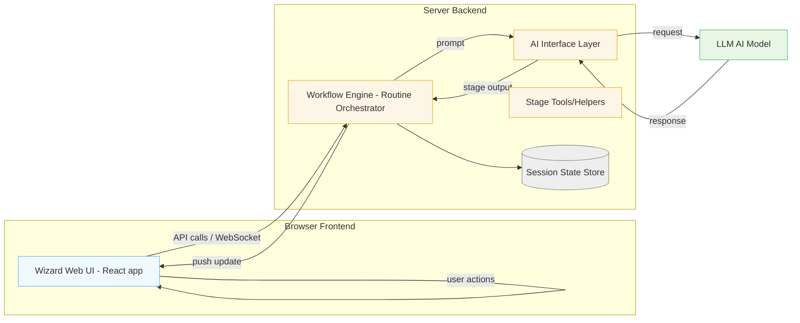
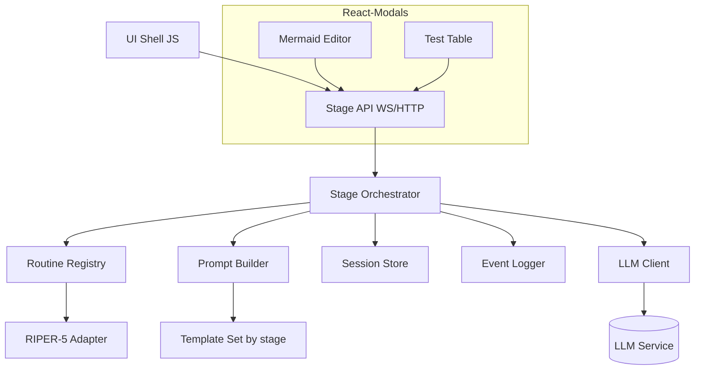
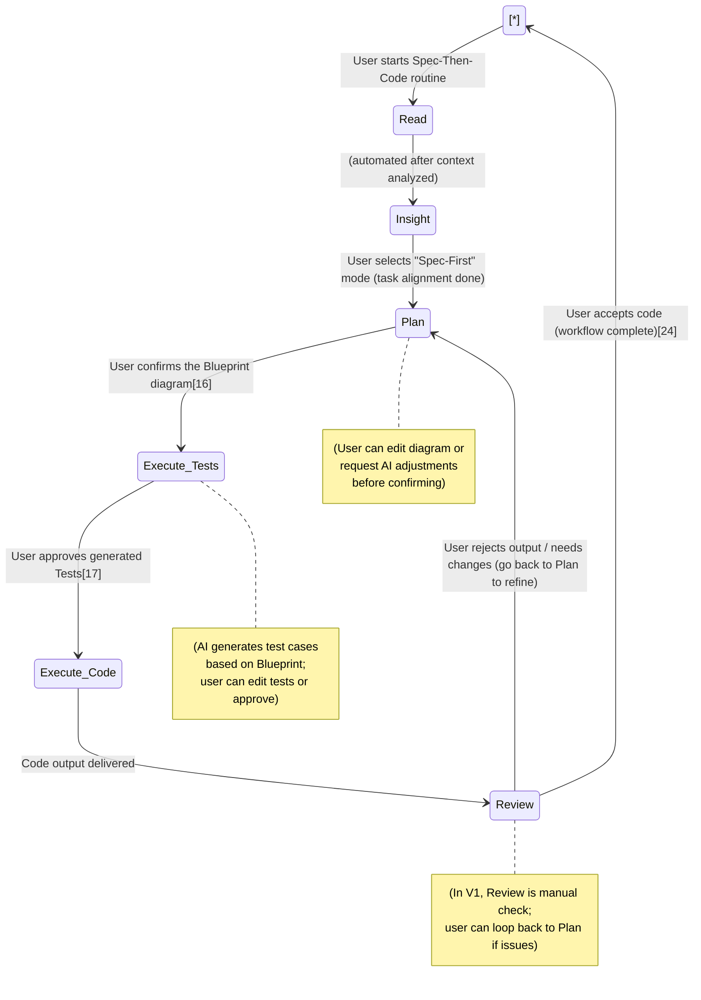
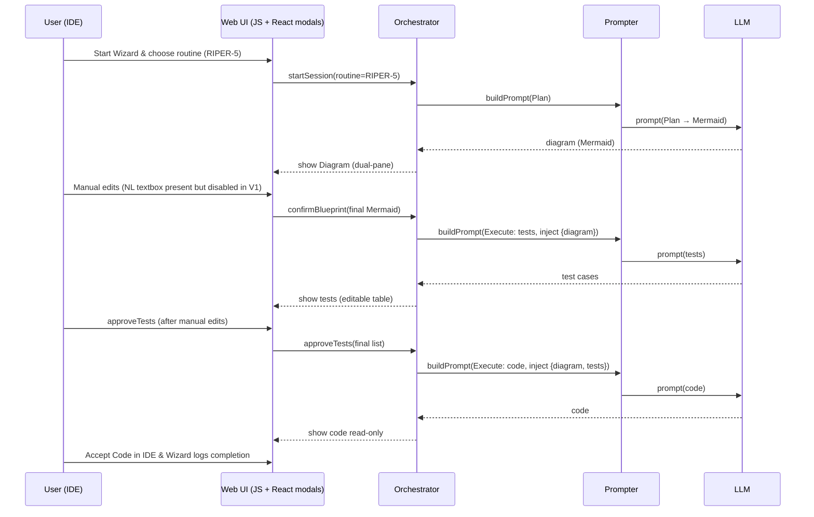

# The Wizard V1 – Technical Design Document

## Executive Summary

The Wizard V1 is a **pluggable multi-workflow AI-assisted development system** focused on a **“Spec-Then-Code”** paradigm. It addresses the trust gap in AI coding by introducing **Diagram-as-a-Spec (DAAS)** – using structured diagrams as binding design specifications between the AI and developer. In the primary V1 workflow (codenamed **RIPER-5**), the AI first proposes a design blueprint in Mermaid diagram form, the user reviews/edits and confirms it, and *only then* does the AI generate test cases followed by code strictly according to the confirmed diagram. This forward-DAAS workflow (diagram → code) ensures transparency and developer control at each step, mitigating “black-box” AI behavior and hallucinations.

V1 delivers an end-to-end implementation of the Spec-Then-Code workflow within a web-based UI integrated into the development environment. Every stage of the interaction – **Read, Insight, Plan, Execute, Refine** (RIPER) – is explicitly guided and gated by user approval. The system is designed with **extensibility in mind**: although RIPER-5 is the first example “routine”, the architecture allows adding new AI workflows in the future via configurable templates. This document details the V1 technical design, covering terminology, scope, architecture (with layered components and control flows), interface contracts, front-end design (modal editors, etc.), data management, security, logging, performance considerations, and a development plan. By the end of the document, stakeholders should have a clear understanding of how The Wizard V1 will be built to achieve a highly controllable AI coding assistant that aligns with developer intent through DAAS.

## Terminology & Source of Truth

* **Workflow Routine (Workflow / “套路”)**: A predefined multi-step AI/user collaboration process to accomplish a coding task. Each routine breaks the task into **phases (stages)** with distinct goals and UI treatments. **RIPER-5** is the primary example routine in V1, representing a five-stage Spec-Then-Code workflow.
* **RIPER-5**: Acronym for the five interaction stages of the Spec-Then-Code workflow:
  **Read** – AI reads and understands context and requirements.
  **Insight** – AI aligns on the task pattern or strategy with the user (e.g. clarifying which workflow quadrant to use).
  **Plan** – AI proposes a **visual plan** in the form of diagrams (the “blueprint”), for user review and approval.
  **Execute** – AI strictly executes the approved plan: first generating test cases, then generating code that fulfills the plan and passes the tests.
  **Refine** – AI and user verify the output against the plan; AI can analyze its output to prove consistency with the plan, and the user gives final confirmation. (In V1, the Refine stage is present conceptually, but some automated aspects are postponed – see *Scope & Non-Goals*).
* **DAAS (Diagram as a Spec)**: The principle of using a **diagram as a formal specification** of the solution design. In The Wizard, a diagram isn’t just documentation – it is the **source of truth** for subsequent generation steps. The AI’s plan output is a structured diagram (e.g. Mermaid flowchart/UML), which the user edits and then “locks in” as the agreed blueprint. All code and tests are then derived from this diagram, treating it as an authoritative spec that the AI must follow exactly. This ensures the AI’s implementation cannot diverge from what the user approved, effectively placing the AI “on rails” defined by the diagram.
* **Blueprint**: The **design diagram** produced in the Plan stage (and potentially other supplementary diagrams/views). It captures the key components, modules, or sequence of logic for the task. In V1, the blueprint is typically a Mermaid diagram (e.g. flowchart, sequence diagram, class diagram) that is human-readable and machine-parsable. Once confirmed, the blueprint serves as the contract between user and AI – it is the **frozen spec** that drives code generation. The blueprint’s Mermaid **text** is treated as the single source of truth for the implementation.
* **Source of Truth**: In this context, the term refers to the **final confirmed diagram artifact** (the blueprint text) that is considered the ground truth specification. All subsequent outputs (test cases, code) must trace back to this source. If there’s any discrepancy, the blueprint is the reference against which corrections are made. This approach ensures consistency from design to code and keeps the AI accountable to the agreed plan.
* **Spec-Then-Code**: The overall methodology enabled by the above concepts – a guided workflow where specification (in diagram form) is created and agreed upon *before* any code is written. It contrasts with end-to-end code generation by inserting a human-verifiable spec step, thereby increasing trust and correctness. “Spec-Then-Code” is the core mode The Wizard V1 implements (as opposed to other modes like quick scripting or traditional TDD, which are out of scope in V1). In the PRD it’s called “规格先行开发”.
* **Routine Engine / Guide Engine**: The back-end component that manages workflow routines. It loads the definition of each routine (stages, prompts, etc.), steps through the stages in order, and handles transitions based on user input and AI outputs. The routine engine ensures that each stage is executed with the correct prompt and that user approvals are obtained before moving on. It is designed to be **pluggable** – new routines can be added via configuration or code without altering the engine’s core logic.
* **Prompt Template**: A parameterized prompt script associated with a given stage of a routine. Prompt templates encode how the AI is instructed at that stage – for example, the Plan stage template will prompt the AI to output a design diagram, whereas the Execute stage template will prompt it to output code, given the blueprint. Templates often include placeholders for dynamic content (like the current **blueprint text** or **test cases**) and enforce certain style or rules (e.g. *“You must not introduce steps not in the diagram”*). They serve as the primary means of guiding the LLM’s behavior in each stage.
* **Mermaid**: A text-based diagram notation (commonly used for flowcharts, sequence diagrams, etc.). The Wizard uses Mermaid as the initial medium for DAAS because of its simplicity and wide adoption in developer tools. The AI outputs Mermaid code for diagrams, and the front-end renders it. Mermaid diagrams are easy to edit as plain text by the user and easy for the AI to parse or regenerate, fitting the DAAS need for a machine-human shared language. (Future versions may support other diagram DSLs, but Mermaid is the focus for V1.)

## Scope & Non-Goals

**In Scope (V1)**: The Wizard V1 will implement a **complete end-to-end “Spec-Then-Code” workflow** with all primary stages and features needed for a basic but usable experience. Specifically, V1 will deliver:

* **Full RIPER-5 Workflow** – The five-stage guided interaction (Read, Insight, Plan, Execute, Refine) for spec-first development, including UI and logic for each stage and transitions through to completion. This includes generating a diagram, getting user confirmation, generating tests, then code, and final user approval of code.
* **Single Routine Focus** – The **Spec-Then-Code** routine (RIPER-5) is implemented in depth. Other collaboration modes (e.g. rapid scripting, prototyping, TDD) will be available only as stubs or simple pass-throughs (the user can select them, but they won’t have specialized multi-stage flows in V1). The architecture will support multiple routines, but full-featured support is **in-scope only for the spec-first routine** in this version.
* **Pluggable Workflow Engine** – The system will include a **config-driven routine registration** mechanism. In V1, this may be as simple as loading a JSON/YAML or using a hardcoded definition for RIPER-5, but the design accommodates adding new routines by providing their stage definitions and prompts without modifying core logic. This fulfills the “workflow container” concept: The Wizard can host multiple guided workflows.
* **Diagram Editing & Confirmation UI** – A dedicated UI for the Plan stage where the AI-generated **DAAS blueprint** is displayed and can be edited by the user (Mermaid source editor with real-time preview). The user **must explicitly confirm** the diagram (e.g. via a “Confirm Blueprint” action) to proceed.
* **Test-first Code Generation** – After blueprint confirmation, the AI will generate key unit **test cases first**, present them to the user (in an editable tabular form), and only proceed to code generation after the user approves the tests. This ensures an additional checkpoint and that code is written to satisfy agreed tests (“tests as spec” aligning with the blueprint).
* **Stepwise User Approvals** – Every critical transition requires user action: e.g. confirming the diagram, approving the tests, accepting the final code. The workflow can also handle user requesting changes at a stage (e.g. regenerate or modify diagram) before moving on. **Ability to go backwards** one step is supported – e.g. after seeing tests or code, the user can decide to go back to the Plan stage to adjust the blueprint (with appropriate state handling).
* **Session State & Versioning** – The system will maintain state across stages, including the original AI outputs and user-modified versions. Particularly, **diagram versioning** is in scope: the system will keep track of the initial AI-proposed diagram vs. the user-edited confirmed diagram (and potentially prior versions if the user iterates). This version control is session-scoped and allows comparing or reverting changes within the workflow.
* **Graceful Failure Handling** – If the AI cannot fulfill a request or hits an error (e.g. “I don’t have enough info to do this”), the system will handle it gracefully rather than crashing the workflow. This may include showing an error message with suggestions, allowing the user to adjust input or abort the routine, rather than leaving the AI in an undefined state. V1 relies on underlying platform stability, but we will catch and present model errors or unfulfillable requests in a user-friendly manner.
* **Basic Logging for Metrics** – V1 will implement minimal logging necessary to compute the **core success metric**: the **Spec-Then-Code happy path completion rate**. This means logging events such as when a session starts, when the user confirms the blueprint, when code generation completes, and whether the user ultimately clicks “Accept Code”. These logs will allow calculating what fraction of initiated workflows result in a completed flow. No full analytics dashboard is built (see non-goals), but the data to measure success is collected.

**Out of Scope (V1 Non-Goals)**: To focus on core functionality, several features and optimizations are **not included in V1** (some were considered in earlier plans but deferred – these are noted as historical adjustments to scope):

* **Other Collaboration Modes** – Aside from the spec-first (Spec-Then-Code) workflow, the other three AI programming modes mentioned (quick scripting, exploratory prototyping, test-driven development) will **not have detailed guided flows** in V1. The UI may present the options, but choosing them will likely result in a simple fallback behavior (e.g. direct one-shot answer) or a message that they are not fully available. The focus is exclusively on perfecting the spec-first guided workflow.
* **Performance Optimizations** – V1 will not spend effort on heavy performance tuning or scaling beyond the baseline provided by the underlying platform. For example, we won’t implement caching of LLM calls, extensive client-side optimizations for diagram rendering, etc., unless needed for basic functionality. The initial target is a functional prototype; performance will be revisited in later versions if needed.
* **Advanced Reliability & Security Hardening** – We will largely rely on the security and reliability features of the host platform (Cursor IDE and any MCP/LLM services) for V1. This means no custom sandboxing beyond basic file access restrictions, no special guardrails beyond prompt-based controls, and no elaborate recovery mechanisms if the backend crashes. Basic compliance (no code auto-writing without confirm, etc.) is in scope, but things like sandboxed code execution or complex security audits are not in V1’s scope.
* **“Guide Store” Marketplace** – The idea of a marketplace or library for sharing/swapping new workflow routines (so that users can download community-created guides) is a future concept and not part of V1. V1 will have the capability to add new routines *for developers internally*, but there is no UI for end-users to add/download workflows at runtime.
* **Fully Automated Code Verification (Reverse DAAS)** – V1 will implement **forward DAAS** (diagram → code) but **will not implement automated reverse-DAAS** (code → diagram consistency checks) in this initial version. Originally, a **Refine stage** was conceived where the AI would generate a diagram from the produced code and compare it to the original blueprint. This is **no longer in V1 scope** due to complexity and time constraints. Instead, the Refine stage in V1 will be minimal (perhaps just a manual review step where the user can compare the blueprint and code by eye). Any automated generation of a “code traceability diagram” or diff highlighting differences is deferred to a future release.
* **“Accept Code” Integration** – While the UI will have an **“Accept Code”** button to finalize the workflow, in V1 this action will **not be deeply integrated** with project version control or automated test execution. Its function is largely to mark the end of the workflow and maybe copy the code into the editor, but it will not, for example, auto-merge changes into a repository or run a full test suite. Integration points such as automatically inserting the code into the user’s file system or committing to git are out of scope for now. The developer will manually review and integrate the code output.
* **Desktop/IDE Native Interface** – The Wizard V1 will run as a **web-based UI** (likely a web view embedded in Cursor IDE or a browser-based panel). A native desktop UI or deep IDE plugin integration is not targeted in V1. The architecture is designed such that a desktop front-end could be added later, but for now we focus on the web front-end. Consequently, offline use or integration into other IDEs (VS Code, JetBrains, etc.) is not included, though we anticipate adding those in future versions.
* **Subagent / Multi-Agent System** – V1 uses a single AI agent (the primary LLM) to handle all stages of the workflow. Although the architecture document envisions a future **subagent system** (multiple specialized AI agents for different tasks), none of that is implemented in V1. There will be no orchestrating of multiple agents or roles; the complexity of coordinating an “AI team” is beyond the initial scope. However, the modular design (tools interface, etc.) lays groundwork that could allow adding subagents later without redesign.

By constraining scope in these ways, we ensure that The Wizard V1 can be delivered in a timely manner with high quality for its core functionality. Future versions will address the non-goals once the viability of V1’s approach is proven in practice.

## System Architecture

### High-Level Architecture

At a high level, The Wizard V1 follows a client-server architecture with a modular design. The main components are:

* **Frontend Web UI** – A browser-based application (embedded in the IDE or Electron container) that provides the user interface: chat interactions, stage navigation, diagram editor modal, test review table, etc. It is built with modern web tech (likely a React-based UI with custom JS/TS). The front-end communicates with the backend via a standardized API (HTTP/REST and/or WebSocket for real-time updates).
* **Backend (Wizard Engine)** – The backend orchestrates the workflow. It maintains the state machine for the current session, invokes the AI model with appropriate prompts for each stage, and handles user feedback loops. It encapsulates several sub-modules:
* **Workflow Engine** – Manages the progression of stages as defined by the active routine. It knows the sequence of stages (for RIPER-5, the order and criteria for moving from one to next) and handles branching or looping logic (e.g. going back to Plan if needed).
* **Prompt/AI Interface Layer** – Responsible for communicating with the Large Language Model (LLM) or AI agent. This layer formats the prompt using the stage’s template, sends it to the model (via an API or through an MCP protocol if running an agent), and obtains the AI’s output. It also may invoke **tools** or external APIs if the AI needs (e.g. a code execution sandbox, a search engine) – though in V1, such tool use is limited.
* **Stage Handlers/Tools** – Specific support for certain stages that require external operations. For example, if we had a stage that needed to run code or retrieve context from files, a handler in this module would do that. In V1, the Plan stage uses a Mermaid renderer (on frontend) but no special backend tool; Execute stage might interface with a code compiler or test runner (though likely minimal in V1). The architecture is modular so each stage’s special needs can be handled in isolation.
* **Workflow Definition Registry** – The logic to load and register available workflow routines. In V1, this will include the built-in definition for RIPER-5. The system can be configured to load additional routines from config files or plugins, though this is primarily for future use. The registry provides the metadata for each stage (name, description, prompt template, UI type, etc.) to the engine.
* **Session State Store** – Data storage for the current workflow’s context and outputs. This keeps track of things like: the initial problem statement, AI outputs at each stage (e.g. the diagram text), user edits (the final diagram), test cases generated, and so on. In V1 this can be in-memory (since each Wizard session is likely short-lived and single-user), possibly with a simple data structure or a lightweight database if needed for persistence across app reloads. It ensures that information flows from one stage to the next and remains consistent.
* **AI Model** – The large language model or AI agent used to generate content. In V1, this could be an API call to a service like OpenAI GPT-4 or an internal model accessible via the MCP (Model-Context Protocol) interface. The AI model is external to The Wizard but is invoked through the AI Interface layer. It’s effectively a dependency providing the “intelligence” for generating diagrams, tests, and code according to our prompts.

Below is a high-level component diagram illustrating The Wizard’s architecture and data flow:



**Diagram Description:** The front-end **UI** communicates with the back-end **Workflow Engine** via API or WebSocket. The Workflow Engine loads routine definitions and manages stage progression. At each stage, it uses the **AI Interface Layer** to formulate a prompt and call the external **AI Model**. The model’s output is returned to the engine, possibly passing through stage-specific **Tools** if needed (e.g. processing or validation). The engine then stores relevant data in the **State Store** and sends the result to the UI. The UI presents the result to the user (e.g. showing the diagram or code) and awaits user actions (edits, confirmations), which feed back into the engine to trigger the next stage. This modular design allows the front-end and back-end to evolve independently and makes it easier to swap out components (for example, use a different AI model or add new tools) without affecting the whole system.

Key design considerations from this architecture:

* **Layered Separation:** We separate concerns into frontend vs backend, and within backend into workflow control vs AI communication vs specialized operations. This makes the system flexible – e.g., the AI interface could be replaced to support a different LLM provider or even multiple models (in future), without changing the workflow logic.
* **Extensibility:** Adding a new workflow routine primarily means adding new config (or classes) in the workflow registry and providing appropriate prompt templates and UI components. The engine logic is generic over any sequence of stages with defined transitions. Similarly, new tools (say a static analysis tool for a new stage) can be plugged in via the Tools module without touching core logic.
* **Frontend/Backend Decoupling:** They communicate via **standard protocols** (HTTP/WS with JSON). This decoupling means we could run the backend as a local service or a cloud service, and the frontend could be embedded in different host apps (web app, desktop app) in future with minimal changes. It also allows the possibility of integrating The Wizard into different IDEs via an API, by treating the backend as a service.
* **State Management:** The use of a session store (in-memory or persistent) ensures that multi-step workflows have continuity. For example, the Mermaid diagram text produced in Plan stage is stored so it can be passed into the Execute stage prompts; user edits are captured and not lost on refresh; if a user goes backward to Plan, the previous state is retrieved (or an earlier version of the diagram can be restored).

### Low-Level Architecture



* RIPER‑5 Adapter provides stage metadata (modes, allowed/forbidden actions, output formatting). No 1:1 semantic mapping is assumed between RIPER‑5 modes and any internal labels; the adapter is the boundary.  
* Template Set contains stage‑scoped prompt templates (Plan/Execute/Review…) with variable slots and constraints.
* Transport is WS/HTTP for events and payloads. The Store persists step artifacts + versions.

### Data & Control Flow (Forward DAAS Workflow)

The sequence of operations in the Spec-Then-Code workflow (RIPER-5) can be viewed as a **state machine** with user-triggered transitions. The system moves through states corresponding to the five stages, with possible loops for refinement. Below is a state diagram of the RIPER-5 routine including key transition triggers:






**Workflow States & Transitions:**

* **Read:** Initial state where the AI gathers context. In practice, this might happen automatically when the routine starts (the AI may summarize the problem or relevant code context). Transition: once the AI has provided initial analysis (or if none needed), proceed to **Insight**.
* **Insight:** The AI (and user) establish the approach. In V1, this stage is lightweight – essentially the user’s choice to engage the Spec-Then-Code workflow. (If the user invoked The Wizard and selected the Spec-First mode, the system is already aligned.) Transition: move to **Plan** either immediately or after any clarifying Q&A.
* **Plan:** The core planning stage where **DAAS comes into play**. The AI produces an initial **Blueprint diagram** (Mermaid code) representing the solution plan. The front-end displays this in the dual-pane editor. The user can modify the diagram (or ask the AI to refine it via natural language input) until satisfied. **Transition:** When the user clicks “Confirm Blueprint”, the final diagram text is sent to the backend. The state machine then advances to the Execute phase.
* **Execute – Tests:** The first part of Execute stage. Upon entering Execute, the backend uses the now-confirmed blueprint to prompt the AI to generate **critical unit test cases** (e.g. happy path scenarios) that the implementation should satisfy. The AI’s proposed tests are sent to the frontend, which displays them in an editable table. The user reviews and can edit these test cases (or add any crucial ones they feel missing). **Transition:** The user presses “Approve Tests & Generate Code” (or equivalent) to signal that the tests are acceptable. This locks in the test specifications and triggers the next sub-stage.
* **Execute – Code:** The second part of Execute. The backend now prompts the AI to generate the actual **implementation code**, explicitly instructing it to follow the approved blueprint and to make sure the code will pass the approved tests. The AI returns code (for one or multiple files or functions), which is delivered to the user, typically in the chat or a code viewer. **Transition:** Once code is provided, the system moves into the Review stage. (Note: If the AI fails to produce code or tests due to error or refusal, the system would handle that as a failure case – possibly letting the user go back or abort gracefully, per the failure handling in scope.)
* **Review:** In an ideal scenario, this is the final verification stage. In the envisioned design, the AI would analyze the produced code and generate a “traceability” diagram to compare with the original blueprint, highlighting any deviations (this would be *reverse DAAS*). However, as noted, V1 will not automate this. Instead, in V1 the Review stage will present the original Blueprint alongside the code output for the **user to manually compare**, possibly with a checklist of things to verify (or simply an instruction to run tests). The UI will provide an **“Accept Code”** button here. The user can at this point either accept the code as satisfactory or decide that changes are needed.
* **Completion or Refinement:** If the user clicks **Accept Code**, the workflow ends successfully (final state). If the user is not satisfied – e.g. they spot a discrepancy or a missing piece – they have the option to **go back to the Plan stage** (or potentially an earlier stage) to refine the design and implementation. The system will support a backward transition from Review to Plan (possibly skipping earlier stages as needed) to allow iteration: the user could edit the diagram to address the issue and then proceed forward again through Execute. In V1, we will implement at least the ability to return to Plan from the final stage; more complex rollback (like jumping back multiple stages) may be limited, but the architecture allows it.

This state machine ensures that data flows in one direction (forward) under normal operation, always gated by user approval at key points, which embodies the forward-DAAS principle. **Data artifacts flow** as follows: initial user query/context → AI’s draft diagram → user-edited diagram (final blueprint) → AI’s test cases → user-approved tests → AI’s code output → (user final check). Each artifact flows into the next step, and nothing is used for generation unless it has been confirmed by the user. This guarantees that the final code is grounded in user-approved specifications.

**Extensibility Points:** The architecture is built to be **extensible** both in terms of adding new workflows and swapping components:

* *Multiple Workflows:* The **routine registry** can hold multiple workflow definitions. In V1, RIPER-5 is the only fully implemented routine, but others can be registered in a configuration file or by code. The engine doesn’t hardcode any RIPER-5 specifics except loading its definition. To add a new routine (say, a TDD workflow with stages like “Write Test → Write Code → Refactor”), a developer would create a config (JSON/YAML or Python class) listing the stages, their order, prompt templates, and any special UI settings. The Wizard can then load it and present it as an option to users. Each routine can define its own sequence of stages and thus orchestrate a different pattern of AI-user interaction.
* *Stage Templates & Tools:* New **prompt templates** can be incorporated easily for different domains or updated as we refine our AI instructions. For example, if we find a better way to prompt the AI to generate diagrams, we can update the Plan stage template without touching other code. Similarly, the design allows plugging in new **tools** or adapters for specific stages. If future workflows require, say, a static analysis step or a documentation generation step, we can add a stage with an associated handler module. The main engine will call it at the right time. As an example, the architecture already envisions possibly calling external code execution in Execute stage or search in Research stage, though in V1 we may not fully utilize these.
* *Replaceable AI Backend:* The AI interface is abstracted such that we could switch between different LLM providers or even a set of models. For instance, in a future with multiple subagents, the Orchestrator agent could query different specialized models (one for coding, one for architecture) and combine results. While V1 sticks to a single model pipeline, the loose coupling (via an interface and message protocol) means we could upgrade the AI component (to a newer model or a self-hosted model) with minimal changes elsewhere.
* *Frontend Modularization:* The front-end is also built in a modular way. Key UI components like the **diagram editor modal** are encapsulated so they can be reused or replaced. If, for example, we later integrate a more advanced diagramming tool or add support for a new diagram type, we could swap out that component. The staged navigation is also data-driven (rendering stages based on definitions), which makes adding a new stage mostly a matter of providing the UI for it. The UI design for each stage is tailored, but using a common framework (React) with shared state management, so additional stages or adjustments to flow can be made without rewriting the entire UI.

In summary, the system architecture provides a robust foundation for the Spec-Then-Code workflow in V1, while being flexible enough to accommodate future enhancements such as new workflows, additional AI capabilities, and different deployment environments.

## Interface Design

This section describes how different parts of the system interact through defined interfaces and data contracts: how routines are specified/registered, how the front-end and back-end communicate, and how prompt templates are structured.

### Routine Registration & Configuration

Workflow routines in The Wizard are defined by a set of stage metadata and associated behavior. In V1, the definition for RIPER-5 is likely hard-coded for expediency, but we treat it as if it were loaded from a config to illustrate the design. A routine definition includes:

* **Routine ID and Name:** e.g. "id": "RIPER-5", "name": "Spec-First Development (RIPER-5)".
* **Stages:** an ordered list of stage definitions. Each stage has:
* An **ID/Key** (e.g. "Research", "Innovate", …),
* A **Human-Friendly Name** (could be same as ID or localized),
* A **Description/Purpose** (what the stage is for, used for tooltips or logs),
* The **Prompt Template** or a reference to it,
* **UI Type/Config** indicating how the front-end should present this stage (e.g. "ui": "chat" for normal chat interaction, "ui": "mermaid\_editor" for the Plan stage diagram editor, "ui": "test\_table" for test review, etc.),
* Any **special parameters** (for instance, a stage might have allowUserEdits: true if the user can edit the AI output directly, as in Plan and Execute/Tests).
* **Transitions & Rules:** Optionally, some rules about how to transition (though generally the engine assumes linear unless a user action triggers a loop).

For example, a simplified JSON-like representation for RIPER-5 might look like:

``` json
{
 "id": "RIPER-5",
 "name": "Spec-Then-Code (RIPER-5)",
 "stages": [
 {
 "id": "Read",
 "name": "Read",
 "description": "AI reads context and requirements.",
 "promptTemplate": "prompt\_read.txt",
 "ui": "chat",
 "requiresUserInput": false
 },
 {
 "id": "Insight",
 "name": "Insight",
 "description": "AI and user align on approach (choose workflow).",
 "promptTemplate": "prompt\_insight.txt",
 "ui": "chat",
 "requiresUserInput": true /\* e.g., user selects an option here \*/
 },
 {
 "id": "Plan",
 "name": "Plan",
 "description": "AI proposes a solution blueprint (diagram).",
 "promptTemplate": "prompt\_plan.txt",
 "ui": "mermaid\_editor",
 "allowsEdit": true,
 "confirmAction": "Confirm Blueprint"
 },
 {
 "id": "Execute",
 "name": "Execute",
 "description": "AI generates tests, then code according to blueprint.",
 "promptTemplateTest": "prompt\_execute\_tests.txt",
 "promptTemplateCode": "prompt\_execute\_code.txt",
 "ui": "code\_generation",
 "confirmAction": "Approve Tests & Generate Code"
 },
 {
 "id": "Review",
 "name": "Review",
 "description": "User reviews output vs. plan, final acceptance.",
 "promptTemplate": "prompt\_review.txt",
 "ui": "review",
 "confirmAction": "Accept Code",
 "allowsEdit": false
 }
 ]
}
```

**Note:** This example is illustrative – the actual implementation may not literally use a JSON file like this in V1, but the design keeps it conceptually similar. The **Execute** stage in this example shows two prompt templates, reflecting that it has two sub-steps (test generation and code generation). Alternatively, this could be modeled as two separate stages (Execute-Tests and Execute-Code) in the list. The Wizard engine is flexible enough to handle either approach. We anticipate possibly representing them as one stage with an internal sequence to preserve the “5” in RIPER-5 for user messaging, but internally it will execute two prompts.

**Routine Registration:** On backend initialization, the system will load the routine definitions (either by reading config files or by constructing them in code). Each routine is registered with the Workflow Engine. If using configuration files, we’ll likely have a folder like routines/ containing riper5.json, etc., which the engine parses. The PRD indicated a preference for JSON/YAML based definitions for portability.

The front-end likely queries the backend for available routines when The Wizard is invoked, in order to display the initial mode selection UI (for the four quadrants of AI programming). In V1, since only spec-first is fully implemented, the other options might be present but disabled or marked beta.

### Frontend-Backend API Contracts

The front-end and backend communicate through a clearly defined interface. We expect to use **WebSocket** for real-time bidirectional communication (so the backend can push stage outputs to the UI as soon as they’re ready), possibly combined with REST endpoints for initiating or controlling sessions.

Key API interactions and their data formats include:

* **Start Workflow**: When the user invokes The Wizard on a task (e.g. via an @TheWizard command in the IDE), the frontend sends a request to start a new session. For example:

**Request:** POST /wizard/start with JSON body {"routine": "RIPER-5", "userQuery": "<User prompt or context>"}.

**Response:** The backend responds with a session identifier and possibly the initial stage output if it’s ready immediately. Alternatively, the response might just confirm session creation, and the actual content from the first stage (Read/Insight) will arrive via WebSocket events.

* **Stage Output Event**: When the AI completes a stage output (e.g., finishes generating the diagram for Plan stage), the backend pushes an event over WS: e.g. an event type "stage\_result" with payload {"stage": "Plan", "content": "<Mermaid code or other>", "render": "mermaid"}. The front-end receives this and renders the appropriate UI (here, open the diagram editor with the Mermaid content).
* **User Feedback/Action**: When the user performs an action like confirming a blueprint or editing something, the front-end sends this to the backend. For instance:
* If the user edits the Mermaid diagram and clicks **Confirm Blueprint**, the front-end sends an event or request like: {"action": "confirm\_stage", "stage": "Plan", "data": {"finalDiagram": "<Mermaid text>"}}. The backend then takes that diagram text, stores it, and proceeds to the next stage (Execute tests generation).
* If the user instead requests a change before confirming (say they type a comment “Please add an error handling step” in a chat input during Plan stage), the front-end might send something like {"action": "user\_feedback", "stage": "Plan", "message": "Add error handling for XYZ."}. The backend would then incorporate that into a prompt to the AI to regenerate or adjust the diagram (essentially staying in the Plan stage).
* **Error Handling**: If something goes wrong (AI fails or any internal error), the backend will send an error event to the UI. For example: {"event": "error", "message": "Unable to generate diagram. Please refine the request or try again."}. The UI will display this gracefully (perhaps as a message in the chat or a notification bar)]. The user can then decide to adjust input or cancel.
* **Progress & Status**: Optionally, the backend might send intermediate status updates (like a “thinking...” or progress percent) to the UI, especially if an operation is taking a while (for instance, generating a large code file). This can be as simple as an event {"event": "status", "stage": "Execute", "status": "Generating code..."} so the UI can show a loading indicator.
* **Session End**: When the user clicks **Accept Code** or otherwise ends the session, the frontend may call an endpoint like POST /wizard/finish or the backend might infer it from the confirm action on Review. The backend can then finalize logs, free resources, etc. The UI might receive a final confirmation event or simply close the Wizard UI.

**Data Types & Examples**:

* **Diagram Data**: The Plan stage output is essentially a text blob (Mermaid syntax). It may also include metadata like diagram type. Example payload excerpt: {"stage": "Plan", "diagramType": "flowchart", "diagramSource": "flowchart TD; A-->B; ...", "notes": "Diagram of module interactions."}.
* **Test Cases Data**: We plan to represent tests in a structured way. Possibly as a list of test case objects, each with a description or given/when/then fields. For UI ease, the backend might send tests as an HTML or Markdown table to render. But a cleaner way: backend sends JSON like:
* {
   "stage": "Execute",
   "substage": "tests",
   "tests": [
   {"id": 1, "description": "Given valid input X, the system returns Y"},
   {"id": 2, "description": "If X is null, an error is logged and no crash"}
   ]
  }
* The front-end can use this to populate a table where the user can edit the descriptions.

After user edits, the front-end sends back perhaps the same structure with modifications. The backend doesn’t need to deeply understand the semantics of tests; it can simply incorporate the final text of each test case into the code-generation prompt.

* **Code Data**: The code output might be sent as one or more code blocks. If the AI returns markdown with triple backticks, the backend could forward that as-is (the UI can render it). Or the backend might structure it with filenames. For example, if multiple files are generated, the backend could send:
* {
   "stage": "Execute",
   "substage": "code",
   "files": [
   {"path": "src/Foo.java", "language": "java", "content": "public class Foo { ... }"},
   {"path": "src/FooTest.java", "language": "java", "content": "@Test ..."}
   ]
  }
* If integration with the IDE is possible, these could even be suggestions to open editors with that content. In V1, likely we’ll just display the code in the chat area or a modal.
* **Confirmation Actions**: For each stage that requires confirmation, the UI and backend need to agree on how to represent it. Likely, the backend when sending a stage result that needs confirmation will include a flag like "awaitingUser": true and maybe an action label. The UI will then enable the appropriate confirm button. When the user clicks it, the backend expects a confirm\_stage action as described. We will standardize this to avoid confusion.

**Error Handling & Edge Cases**: - If the AI returns output that doesn’t parse (e.g., a Mermaid syntax error), the backend could catch this by attempting to render or validate Mermaid (possibly using a Mermaid parser library). If invalid, the backend can either retry with a refined prompt or notify the UI so the user knows the diagram might be incomplete. In V1, we lean on the user to spot issues, but we’ll try to at least not crash. The diagram editor might highlight syntax errors (Mermaid parsing errors) client-side as well. - If the user becomes unresponsive (e.g., doesn’t confirm or provide input), the backend will essentially idle. We might implement a timeout or ping to keep the session alive, but no drastic action (the user is always in control, so the AI waits). - If the user cancels the workflow mid-way (closes the Wizard UI), the front-end should notify the backend to terminate the session to free resources (especially if the AI was in the middle of a long generation). - If network disconnects, the system should allow resuming the session if possible. This may not be fully handled in V1 beyond relying on the user to restart a new session if things break.

Overall, the front-end/back-end contract is designed to be **explicit and stateless between steps** (each message contains the info needed to understand it, using the session context on the backend). By clearly delineating message types and payloads, we ensure the two can evolve somewhat independently and ease debugging (we can log or inspect the JSON messages flowing through).

### Prompt Templates Design

Prompt templates are central to guiding the LLM’s behavior in each stage. Each template is basically a text with placeholders, written to imbue the AI with the right instructions, context, and formatting requirements.

General principles for templates in The Wizard V1:

* **Stage-Specific Role**: Each template sets the context of the stage, often by explicitly telling the AI what its goal is in that step (e.g. “You are now in the Plan stage. Produce a system design diagram...”). This aligns the AI’s output with the expected outcome of that stage.
* **Context Injection**: The template will include placeholders for relevant context from previous stages. For example:
* In Plan stage, the template includes the **user’s requirements or prompt** (from Insight stage or initial query) and any insights gathered.
* In Execute stage, the template includes the **final Blueprint diagram text** and the **approved test cases**.
* In Review stage (if it were automated), it would include both blueprint and code.
* **Format & Style Instructions**: We instruct the AI on how to format its answer. For Plan stage, we’ll instruct it to output Mermaid syntax (and possibly nothing else extraneous, maybe a brief explanation if needed but likely we want primarily the diagram code). For Execute stage, we instruct the AI to output code in proper fenced blocks, including file names if multiple (maybe using the markdown syntax extension like ```java:FileName.java for clarity).
* **Strong Constraint Language**: Especially for the Execute stage, the prompt will **strongly emphasize that the AI must strictly follow the blueprint and tests** and not introduce any unwarranted changes. For example, the prompt might say: *“You are to implement the solution* *exactly as per the confirmed design. DO NOT add new steps or modules not present in the design. Ensure all of the following tests will pass:”* and then list the test cases. This acts as a safeguard against hallucination or scope creep. It effectively turns the blueprint into a contract that the AI is bound to.
* **Blueprint and Test Injection**: The blueprint text will be injected in a way that the AI can easily reference it. We might format it as a code block or as a preserved section. For example, the Execute-code template could be:
* You have the following design specification (Mermaid diagram) approved by the user:
  ```mermaid
  (diagram text)
* And the following unit tests to satisfy:
* Test1: ...
* Test2: ...

Write the complete implementation in code that follows the design and passes all the tests. ``` By providing the diagram in the prompt, the model can parse it or at least use it as a structured guide. We will also instruct the model to make sure every element in the diagram is implemented and nothing outside of it is implemented.

* **Mode Declarations (if any)**: The internal design of the AI agent might require special mode syntax (for instance, if using an agent like in the RIPER-5-EN.md instructions, it had things like [MODE: PLAN] prefixes). In V1, since we control the outputs, we might not need to expose those mode tags to the user, but the prompt may include certain tokens to keep the AI on protocol (e.g., telling it which mode it is in to prevent it from doing out-of-scope actions). Ensuring the AI does *not* deviate from the plan is paramount – if the underlying AI was fine-tuned or prompted with a system message containing the protocol (like in RIPER-5-EN.md), we will leverage that. The templates will likely reference that underlying guidance, for instance reminding: *“(You are in EXECUTE mode; follow the plan checklist exactly)”*.
* **User Language & Tone**: The PRD noted that responses should be in Chinese for the user-facing parts, with certain technical outputs in English for consistency (like mode names, code, etc.). The prompt templates will enforce this: for example, the Plan stage might generate the diagram (which is language-agnostic), but any explanatory text AI gives might need to be in Chinese (if it describes the diagram). We’ll instruct the AI accordingly on language. Similarly, test case descriptions could be generated in Chinese to align with user language, or in code form if it’s actual code. We ensure the templates cover this localization aspect (e.g. *“Answer the user in Chinese. Only use English for code or mode tags.”* as needed).
* **Examples and Few-Shot**: We might include example formats if necessary to guide the AI. For instance, in the Plan prompt, we might provide a mini example of a Mermaid diagram format so it knows to produce just the code. In the Execute prompt, if multiple files are expected, show an example format using triple backticks with file names. This helps ensure the output is parseable by our UI.
* **Testing Prompt**: For test generation (Execute-tests substage), the template will prompt the AI to output a set of test cases likely in a simple descriptive form. We’ll likely instruct it to focus on *“critical happy path and edge case scenarios, without code, just descriptions or pseudocode of tests”*. This output should be concise and clear, as it will be shown in a table for user approval.

**Prompt Template Example Snippets**:

* *Plan Stage Template (pseudo):*
* [System role:] You are an expert software architect helping to plan the solution.
  [Instruction:] Propose a design for the following requirements in the form of diagrams.
  Include a sequence of steps or component interactions. Use Mermaid syntax to create:
  1. A sequence diagram or flowchart showing the process flow.
  2. A class or module diagram showing key components (if applicable).
  Ensure the diagrams cover all key requirements identified.
  Only output the Mermaid code for the diagrams, prefaced by a short title if necessary.
  [Context:]{requirements\_and\_context}

*Rationale:* This would yield something like a flowchart and maybe a class diagram text. (We might actually use two separate prompts to get two diagrams, or one prompt that yields two diagrams in one go, depending on model capability. FR-2.1 suggests two views, but implementing both might be ambitious. At least one diagram is certain.)

* *Execute (Tests) Template:*
* [System:] You are a meticulous test engineer.
  [Instruction:] Based on the approved design below, enumerate the key unit tests (in plain language or pseudocode) that the implementation must pass. Focus on the core functionality and one or two edge cases.
  Format as a list of test case descriptions.
  Design Blueprint:
  """mermaid
  {diagram\_text}
  """

*Output:* The AI might list tests: “1. When X happens, the system should do Y. 2. If input is invalid, the system should log an error and not crash. ...”

* *Execute (Code) Template:*
* [System:] You are now an implementation assistant.
  [Instruction:] Implement the solution \*\*exactly\*\* according to the design and tests below.
  - \*\*Do not deviate\*\* from the design. Do not add new functionality not described.
  - Ensure the implementation will satisfy all the tests.
  Design Blueprint (for reference):
  """mermaid
  {diagram\_text}
  """
  Approved Tests (for reference):
  {test\_list\_text}
  Now, produce the complete code. Include all necessary classes/functions. Use proper code blocks with language annotations.
  If multiple files are needed, separate them clearly (e.g., one code block per file with the file path in the header).

This template explicitly reminds the model to follow the blueprint structure and cover the tests. It provides the blueprint and tests as references. With this, we expect the model to translate each part of the diagram into code, and ensure, for example, if a step “Validate input” is in the diagram, the code indeed has input validation logic, etc. The tests listed also guide what conditions the code must handle.

However, since automatic review is out of scope, we might not implement this prompt. Instead, the “Accept Code” step is simply user-driven.

All prompt templates will be stored as separate files or constants for easy maintenance. They will undergo iteration and tuning, as prompt quality is crucial for the system’s success.

Finally, to enforce the protocol, the system might prepend a high-level system message to all conversations with the AI that includes core rules (like those in the context primer: no unsolicited changes, require explicit user approval to move mode, etc.). This acts as a guardrail around all stage-specific prompts.

In summary, the interface and prompt design ensures that: - The **routines are configurable** and understandable (making future extension feasible). - The **frontend-backend contract** covers all user interactions clearly (ensuring smooth UX). - The **prompts are crafted to tightly align the AI’s output** with the blueprint/test spec, reinforcing the DAAS approach and the principle of developer control.

## Frontend Design

The Wizard’s frontend is responsible for delivering a fluid, guided experience through the multi-stage workflow, all within the developer’s IDE environment. Key aspects of the frontend design include its overall information architecture, the specialized UI for certain stages (especially the diagram editing), and accessibility considerations.

### Information Architecture & Layout

The UI follows a **wizard-style, step-by-step interface** embedded in the IDE. The general layout consists of:

* A **main interaction panel** (which could be the existing chat panel in Cursor IDE, or a dedicated sidebar/pane) where the conversation and outputs appear.
* A **stage indicator/progress bar** at the top or side, showing the current stage (Read, Plan, Execute, etc.) and possibly the upcoming stages. Completed stages might be marked with a check, the current stage highlighted, and future stages greyed out. This gives users a mental model of where they are in the process at all times.
* The main panel content changes depending on the stage:
* For text-centric stages (Read, Insight, parts of Execute), it appears as a chat-like interface with AI messages and user messages.
* For the Plan stage, a special **dual-pane diagram editor** appears (likely as a modal overlay to give more space).
* For the Execute tests stage, an **editable table** or list of test cases is shown.
* For the Execute code stage, a code output view (which might just be the normal chat with code blocks, or a slightly enhanced code viewer).
* For the Review stage, possibly a side-by-side view of diagram and code, or a checklist UI for verification.
* **Controls and Navigation**: Each stage view has appropriate controls:
* A **“Next” or “Confirm” button** when user input/approval is required to advance.
* A **“Back” or “Edit” option** if going backward is allowed (e.g. in Review stage, a “Revise Plan” button to jump back).
* In Plan stage, tools to either edit text or perhaps shape tools (though initially just text edit).
* In text/chat stages, a standard text input box for the user to type questions or feedback to the AI.
* The UI is largely **embedded**, meaning it doesn’t take the user out of their coding context. For instance, the Plan stage editor might be a pop-up modal on top of the IDE, rather than a separate window, so that the user can still see the code behind if needed. Once they confirm, it goes away and returns to the main panel.

**Stage-Specific UI Behaviors**: - **Research/Read & Insight Stages**: These early stages are mostly conversational. The AI might display some findings or ask a question, and the user can respond via the chat input. The UI might show a summary of context in a subtle way (for example, if the AI identified key points from the user’s problem, it might bullet them). Largely, these look like a typical chat with Q&A format, possibly with an icon or label indicating “Research Mode” or “Insight Mode”.

* **Plan Stage (Diagram Editor)**: This is the most UI-intensive part:
* Implemented as a **dual-pane editor** – left side has a text editor with the Mermaid source, right side shows a live-rendered diagram preview. The preview updates as the text changes (with a short debounce to avoid overly rapid re-render).
* The editor should have syntax highlighting for Mermaid, and possibly line numbers. If the Mermaid syntax has an error, we could highlight it or show an error message (helping the user fix any mistakes).
* There may be **two diagram tabs/views** if we generate both a sequence diagram and a class diagram (as per FR-2.1). For example, the modal might have tabs: “Flowchart View” and “Structure View”. The AI might generate both diagrams, and the user can toggle between them to cross-verify consistency. This is a stretch goal; if only one diagram is present, we will just show that.
* There is a **natural language feedback box** in this modal as well (if screen space permits). This would allow the user to type something like “Looks good, but add a step to validate input before processing” – upon pressing Enter, this feedback is sent to the AI, which could then update the diagram accordingly (the AI’s updated diagram would replace the text in the editor). This complements direct editing: users less comfortable with Mermaid can describe changes in NL and let AI do it.
* A prominent **“Confirm Blueprint”** button is available (likely bottom-right of the modal). It remains disabled until at least one diagram is present and possibly until the user made some acknowledgment. When clicked, the modal closes and the workflow proceeds.

For accessibility and usability, the diagram editor modal should be resizable or large enough by default since diagrams benefit from space. We will also allow copy-pasting the diagram text in case the user wants to save it.

* **Execute Stage (Tests)**: After confirming the diagram, the UI transitions to a test case view. This might be integrated in the chat or as another modal. Likely, a simple approach:
* Present a list or table of test cases. For instance, a two-column table: “Test Case Description” and perhaps “Expected Outcome”.
* Each test case might be editable inline (user can click and edit the text).
* The UI might allow adding or deleting test cases (a small “+ Add test” button and a trash icon for removal).
* A **“Approve Tests & Generate Code”** button is shown above or below the test list. The user clicks this when done reviewing.
* If the user makes changes, those should reflect in what we send to the backend (so we collect the edited text).

Optionally, if this is too heavy, we might simplify by having the AI’s tests appear in the chat as a message and then ask user “Do you approve? (Yes/No)”. But the PRD explicitly calls for an editable table UI, so we aim for that.

* **Execute Stage (Code)**: Once tests are approved, the AI will stream/generate code. The UI here likely reverts to a chat-like view where the AI’s message contains code blocks. If the code is long, we might put each file’s code in collapsible sections or provide a “copy to clipboard” for each block. The user can scroll through the code. Since this is a critical moment, we might highlight portions that correspond to parts of the diagram (though doing that automatically is advanced; more likely, the user will manually cross-ref with the open diagram if needed).
* If the code is generated as part of the chat, the normal chat input might be disabled here because we don’t expect the user to type arbitrary messages while code is being output. Instead, they should move to the review/accept stage.
* We may show a small note like “Code generated based on the blueprint above. Please review.”
* If the integration allows, perhaps an “Open in Editor” button to send this code into the actual file (but that’s more of an integration task possibly out-of-scope due to no auto-write).
* **Review Stage (Verification)**: In V1, since automated diff is not there, the UI for review could be minimal:
* Possibly reopen the diagram editor in a read-only mode alongside the code for side-by-side view. For example, a split view: left side shows the final blueprint diagram (rendered, with maybe the text beneath), right side shows the code (maybe one file at a time or summary).
* Or, simpler: present a checklist of what to verify (like: “All steps in the blueprint are implemented in code”, “All tests pass (if you run them)”, etc.), and then an **“Accept Code”** button.
* When the user clicks Accept Code, perhaps we show a success message “Workflow complete!” and close the Wizard panel.

In case the user is not happy, we should allow a way to go back. Perhaps a **“Revise Blueprint”** button that jumps back to the Plan stage with the previous diagram loaded (or maybe they’ll have to re-describe their issue to the AI). We have to manage state carefully for that scenario (the code and tests might become stale once we go back, but that’s fine since we’ll regenerate them after the diagram change).

* **General UI Behavior**: The **natural language input box** (chat box) may not always be active:
* During Plan stage when the diagram editor is open, we might disable or hide the main chat input to focus interaction through the diagram modal and its own feedback field. This avoids confusion (the user shouldn’t be sending general chat messages while the blueprint modal is up) – they should either edit directly or use the modal’s feedback input. Thus, we **disable the regular NL input** during certain phases to enforce the structured flow.
* Similarly, when test cases are shown awaiting approval, we likely disable the chat input (to prevent the user from skipping ahead with a random query or instruction). They should either approve tests or edit them. Only after that, the next stage (code) will proceed.
* We re-enable the chat input in review stage if the user wants to discuss issues with the AI. But if they do, that essentially means going back in the workflow. Perhaps if user types “The code missed a step”, the system could interpret it as wanting to refine – ideally we funnel that into an action like “Alright, let’s go back to Plan and address that.” In V1, it might be simpler to require pressing the explicit back button rather than free chat in review.

These design choices align with the first principle that *the developer is in control but within a guided structure* – by limiting what they can do at a given time (for example, can’t ask the AI to do something unrelated in the middle of the guided flow), we maintain focus and prevent the conversation from derailing the workflow.

* **Styling and Theming**: The Wizard UI should blend with the IDE’s look as much as possible. Likely we’ll adhere to Cursor’s theme (dark mode, etc.). Diagrams will use default Mermaid theming (which has a dark theme variant if needed). We must ensure good contrast for text and diagram lines (especially in dark mode).

## Data & Persistence

Handling data consistently across the multi-step workflow is crucial. While The Wizard V1 doesn’t require heavy long-term persistence (we are not yet saving project artifacts automatically), it does maintain a variety of data during a session. We also want a record for possible debugging or audit (especially of decisions made at each step).

**Session State Management**: The backend will maintain a **session context object** for each active Wizard session. This context includes:

* **User Input Context**: The initial query or task description from the user, plus any relevant project context we pulled in (for example, if the user invoked The Wizard with some code selection or open file, we might store that context so the AI can refer to it in Read stage).
* **Stage Outputs**: For each stage, we store what the AI produced and any subsequent user modifications:
* *Read/Insight:* store the AI’s analysis or the chosen mode.
* *Plan:* store the initial AI-generated Mermaid diagram text, and the final user-confirmed Mermaid text (these could differ if the user edited). We might also keep incremental versions if the user iterated (e.g., AI made diagram v1, user said “change X”, AI made v2, etc.) – possibly store those in a list or at least the last one before user edits.
* *Execute Tests:* store the list of test cases proposed, and the final list after user edits (if any). Even if the user didn’t edit, mark them as confirmed.
* *Execute Code:* store the code output. This might be large, so we can either store references (like file pointers if code is written to a temp file) or just keep it in memory as a string. At least until the session ends, we keep it to possibly enable review comparisons. (We may not persist code to disk automatically due to safety, but we keep it in memory.)
* *Review:* store the outcome (did user accept? did they go back for revision?).
* **Metadata**: timestamps for each stage transition (when did AI finish, when did user confirm) – useful for logs and potential future performance tuning.
* **Versioning**: Specifically for **diagram versioning**, as required, we can implement a simple version history. Each time a new diagram is generated or the user edits it, we create a new version entry in an array (with timestamp and maybe who (AI or user) made it). This could be used to implement an “undo” or just for record. In V1, we might not expose multiple undo levels, but we do want to at least keep the original AI proposal and the user’s final version. If the user re-enters Plan after a Review rejection, that effectively starts a new version thread (we might then start version 2 of the diagram).
* **Storage Mechanism**: Likely, this session state can live in memory (as part of a Python object or JS object in Node backend). If the Wizard backend runs inside the IDE, memory persistence is fine. If we wanted to persist across sessions (not required in V1), we could serialize it to a JSON file in a .wizard folder in the project or a database. V1 probably doesn’t need disk persistence beyond logging events (i.e., when the user closes the IDE, the session is gone).
* **Concurrency**: It’s expected a developer might run one Wizard session at a time (or a few). Each gets its own context. The design doesn’t require shared data between sessions, except some caches possibly. But we can treat them separately.

**Diagram as Source of Truth**: Once confirmed, the **diagram text is stored as the authoritative spec**. We treat it as read-only spec for Execute stage and beyond. If the user goes back to Plan, we unlock it again (and presumably mark code as stale). We ensure only the latest confirmed diagram is used for generation, to avoid any mix-ups.

**Test Cases Storage**: The tests, once approved, are similarly stored as part of the spec for code generation. Interestingly, these test cases *could themselves be considered an artifact worth saving*. In a future version, we might output them as actual test code files. In V1, we don’t automatically write them out; however, we may keep them such that the user could copy them if desired. If the AI provided them in plain language, the user might then ask the AI (or manually) to translate into actual unit test code. But that’s outside the main workflow.

If we were to persist any of these beyond the session, likely candidates are: - The final blueprint diagram (maybe stored in a file like Design\_123.mmd or as an attachment in the IDE) – but not doing in V1 automatically. - The test cases (perhaps in a Markdown in a .wizard or .tasks folder). The design doc hints at maybe storing task files, but that’s more related to the R-I-P-E-R agent concept outside our UI. V1 probably won’t drop files in the project unless user does so manually.

**Event Logs**: In addition to session state, the backend will produce log entries for observability (discussed later). These logs might also double as a lightweight persistent record of what happened (though not intended to reconstruct full state). For example, a log line could be “2025-10-19T12:05: User confirmed blueprint (version 3) with 1 edit”. That plus storing the diagram text in memory suffices.

**No Auto-Save of Code**: A key compliance decision is that **we do not automatically write the generated code to the user’s filesystem** (or modify files) without explicit user action. So, while we hold the code in memory to display and possibly for diffing, we won’t, for instance, open the actual file and insert it. The user must manually take that code and put it into their codebase (or maybe use an IDE action like “apply suggestion” if available). This avoids any unwanted overwriting of their existing code and aligns with the principle of developer control.

**If user does Accept Code**: We might integrate with the IDE by, say, inserting the code into the editor at the appropriate location if it’s clear. But since Accept Code integration is not in V1, Accept Code likely just ends the session. We might give a prompt like “Code accepted. Please integrate the above code into your project as needed.” For future or for the user’s convenience, we could consider generating a patch or diff that they can apply manually – not in V1 scope, but storing the code output means we could generate a unified diff against existing files if we had that context. For now, we simply keep the code available on screen or in the session state for the user to copy.

**Versioning & Rollback**: If user goes backward (e.g., after seeing code, goes back to change the diagram), how do we treat the intermediate data? - The system should invalidate or discard the now-obsolete test cases and code, since they may no longer align with the new blueprint. We might keep them in memory for reference (maybe the user changed their mind and wants to see what the previous code was – but that’s probably not needed). We likely start a new Execute phase fresh. Possibly, for safety, we create a new session context or branch. - Version the blueprint such that blueprint v1 had code v1. If blueprint v2 is made, we could keep code v1 around only in logs. - The UI will be reset to the Plan stage UI when going back, and the Execute outputs cleared or archived.

**Persistent Settings**: Some user preferences might be stored if relevant: - For example, if the user resizes the diagram modal or chooses a different layout, we might remember that in local storage. - If the user decides to skip certain steps in future (maybe not in V1, but if they always want to skip Research stage, a setting could control that). - This is minor and not core to design, just noted.

**Data Privacy**: If any of the data is sensitive (user’s code, etc.), we ensure it’s not logged externally. The context we send to the AI obviously leaves the system to an LLM service, but that is inherent. We won’t store user’s proprietary code anywhere permanent. The ephemeral session memory is cleared after session. Logs might contain minimal references (like “function names”), we should avoid logging full code or prompts to be safe.

In summary, data in The Wizard V1 is primarily managed in-memory through the workflow, with careful versioning for the blueprint spec and tests to ensure consistency. Persistence is minimal and just enough to support the user’s session and measure outcomes, aligning with V1’s focus on a single-session guided flow rather than long-term artifact management.
