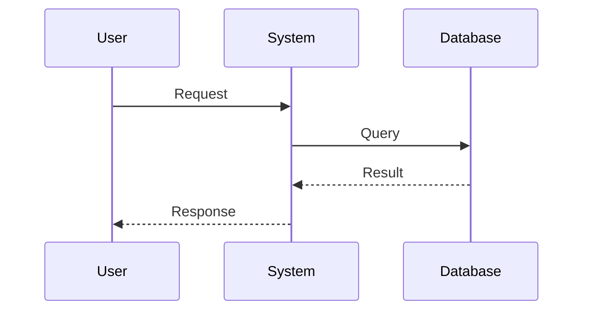

# The Wizard V1 - Implementation Plan (Updated After Codebase Investigation)

**Date**: 2025-01-20  
**Status**: ACTIVE  
**Version**: 2.0 - Post-Investigation Update

## Executive Summary

Transform the existing mcp-feedback-enhanced foundation into **The Wizard V1**, implementing the RIPER-5 workflow (Read → Insight → Plan → Execute → Refine) with Diagram-as-a-Spec (DAAS) methodology.

**Key Finding**: The codebase already provides **80% of required infrastructure**. We can build The Wizard by **extending existing patterns** rather than building from scratch.

**Implementation Strategy**: 
- Introduce React + Vite for NEW Wizard UI components
- Extend (not replace) existing WebUIManager/WebFeedbackSession patterns  
- Leverage complete YAML workflow definition already in `spec_then_code.v1.yaml`
- Reuse WebSocket, session management, and error handling infrastructure

---

## Codebase Investigation Summary

### What We Have (Production-Ready Foundation)

#### Backend (Python 3.11+, FastAPI, WebSocket)

```
src/mcp_feedback_enhanced/
├── server.py                 # MCP tool entry: interactive_feedback
├── web/
│   ├── main.py              # WebUIManager (singleton), session lifecycle
│   ├── models/
│   │   └── feedback_session.py  # WebFeedbackSession (state machine)
│   ├── routes/
│   │   └── main_routes.py   # FastAPI routes, /ws WebSocket endpoint
│   ├── templates/
│   │   └── feedback.html    # Reference for wizard.html structure
│   └── static/
│       ├── js/
│       │   └── app.js       # Modular vanilla JS, window.MCPFeedback namespace
│       └── css/
│           └── styles.css   # CSS framework to extend
├── wizard/                   # ⚠️ PLACEHOLDER - to be implemented
│   ├── wizard_app.py        # Streamlit stub (to be replaced)
│   ├── guide_engine.py      # Empty WorkflowEngine
│   └── ui_components.py     # Empty
├── config/
│   └── spec_then_code/
│       └── spec_then_code.v1.yaml  # ✅ COMPLETE workflow definition!
└── utils/
    ├── error_handler.py     # Centralized error handling
    └── resource_manager.py  # Cleanup callbacks, temp files
```

**Key Reusable Components:**
- ✅ FastAPI server with WebSocket `/ws` endpoint
- ✅ Session management pattern: `WebUIManager` + `WebFeedbackSession`
- ✅ State machine: `SessionStatus` enum with single-direction flow
- ✅ MCP tool integration: `interactive_feedback` function
- ✅ Error handling framework with context logging
- ✅ Resource cleanup callbacks
- ✅ I18n support (en, zh-CN, zh-TW)

#### Frontend (Vanilla JS, Modular)

**Namespace Pattern**: `window.MCPFeedback.*`

**Existing Managers** (to reference, not replace):
- `WebSocketManager`: Connection, reconnection, heartbeat
- `SessionManager`: Session history, persistence
- `ImageHandler`: File upload, preview
- `PromptManager`: Template management
- `UIManager`: Tab switching, state management
- `NotificationManager`: Browser + audio alerts
- `AudioManager`: Sound effects
- `SettingsManager`: Local storage persistence

**Architecture Style**:
```javascript
(function() {
    'use strict';
    window.MCPFeedback = window.MCPFeedback || {};
    
    function FeedbackApp(sessionId) {
        this.sessionId = sessionId;
        this.managers = {};
    }
    
    window.MCPFeedback.FeedbackApp = FeedbackApp;
})();
```

#### Workflow Definition (Already Complete!)

`src/mcp_feedback_enhanced/config/spec_then_code/spec_then_code.v1.yaml`:

```yaml
metadata:
  name: "Spec-Then-Code Workflow"
  version: 1
  start_step: "COLLECT_CONTEXT"
  modes: ["RESEARCH", "INNOVATE", "PLAN", "EXECUTE", "REVIEW"]

steps:
  - id: "COLLECT_CONTEXT"
    title: "Collect Problem Context"
    mode: "RESEARCH"
    type: "ui_prompt"
    component: "initial_request_form"
    # ... 13 more steps defining complete RIPER-5 flow
```

This YAML **already defines the entire workflow**! We just need to implement the engine to execute it.

---

## Gap Analysis: What We Need to Build

### Backend Gaps (Python)

| Component | Status | Effort | Notes |
|-----------|--------|--------|-------|
| `WizardUIManager` | ❌ NEW | Medium | Parallel to WebUIManager, manage wizard sessions |
| `WizardSession` | ❌ NEW | Medium | Parallel to WebFeedbackSession, multi-stage state |
| `WorkflowEngine` | ❌ NEW | High | Load YAML, execute steps, manage transitions |
| `StageHandler` base | ❌ NEW | Low | Base class for stage logic |
| Stage Handlers (5) | ❌ NEW | High | Read, Insight, Plan, Execute, Refine |
| `wizard_routes.py` | ❌ NEW | Low | `/wizard`, `/ws/wizard`, API endpoints |
| MCP tool: `start_wizard` | ❌ NEW | Low | Entry point in server.py |
| Prompt templates | ❌ NEW | Medium | 5 files for LLM prompts |

**Estimated Backend Effort**: ~3-4 weeks

### Frontend Gaps (React + Vite)

| Component | Status | Effort | Notes |
|-----------|--------|--------|-------|
| Vite project setup | ❌ NEW | Low | `vite.config.ts`, React + TypeScript |
| Mode Selector (4-quadrant) | ❌ NEW | Low | React component, only Spec-First functional |
| Mermaid Editor | ❌ NEW | High | Dual-pane, syntax highlighting, live preview |
| Test Table Editor | ❌ NEW | Medium | Editable table, add/delete rows |
| Code Display | ❌ NEW | Low | Syntax-highlighted, multi-file tabs |
| Refine Compare View | ❌ NEW | Medium | Side-by-side diagram comparison |
| Wizard State Manager | ❌ NEW | Medium | React Context for workflow state |
| WebSocket Client | ✅ REUSE | Low | Adapt existing WebSocketManager |
| Build integration | ❌ NEW | Low | Vite build → static assets |

**Estimated Frontend Effort**: ~3-4 weeks

---

## Revised Architecture Decisions

### 1. Session Management Strategy

**Decision**: Create **separate** `WizardUIManager` and `WizardSession` classes

**Rationale**:
- ✅ Clean separation of concerns
- ✅ No risk to existing feedback system
- ✅ Easier testing and maintenance
- ✅ Different state machine needs (multi-stage vs. single feedback)

**Pattern to Follow** (from `WebUIManager`):
```python
class WizardUIManager:
    def __init__(self, host: str = "127.0.0.1", port: int | None = None):
        self.host = host
        self.port = port or find_free_port()
        self.app = FastAPI(title="The Wizard")
        self.current_session: WizardSession | None = None
        self.sessions: dict[str, WizardSession] = {}
        setup_wizard_routes(self)  # NEW routes file
```

### 2. Workflow Engine Architecture

**Decision**: YAML-driven state machine with pluggable stage handlers

**Components**:
1. **WorkflowEngine**: Loads YAML, manages state transitions
2. **RoutineRegistry**: Parses YAML into executable steps
3. **StageHandler** (base class): Interface for each stage type
4. **Concrete Handlers**: ReadHandler, InsightHandler, PlanHandler, etc.

**State Storage**: `WizardSession.workflow_state`
```python
{
    "current_step_id": "REVIEW_BLUEPRINT",
    "mode": "PLAN",
    "artifacts": {
        "user_request": "...",
        "blueprint_mermaid": "...",
        "test_matrix": [...]
    },
    "step_history": ["COLLECT_CONTEXT", "INSIGHT_CLASSIFICATION", ...]
}
```

### 3. Frontend Technology Stack

**Decision**: Hybrid - React for Wizard, Vanilla JS for Feedback

**Setup**:
```
src/mcp_feedback_enhanced/web/
├── static/                    # Existing vanilla JS
│   └── js/
│       └── app.js            # Keep intact
├── wizard-ui/                # NEW React app
│   ├── src/
│   │   ├── components/
│   │   ├── store/            # Zustand or Context API
│   │   └── main.tsx
│   ├── vite.config.ts
│   └── package.json
└── templates/
    ├── feedback.html         # Existing
    └── wizard.html           # NEW, loads React bundle
```

**Vite Configuration**:
```typescript
// vite.config.ts
export default defineConfig({
  root: 'src/mcp_feedback_enhanced/web/wizard-ui',
  build: {
    outDir: '../static/wizard-dist',
    emptyOutDir: true
  }
})
```

**Development Workflow**:
1. Dev mode: Vite dev server at `http://localhost:5173`
2. Production: `vite build` → static assets in `/static/wizard-dist/`
3. Jinja template loads bundled assets

### 4. React Component Library Selection

**Decision**: Shadcn/ui + Radix UI primitives

**Rationale**:
- ✅ Headless components, full control over styling
- ✅ Accessible by default (WCAG compliant)
- ✅ Works with existing CSS variables
- ✅ Tree-shakeable, small bundle size
- ✅ No runtime dependencies (copy-paste components)

**Components Needed**:
- Button, Input, Textarea (basic)
- Tabs, Dialog, DropdownMenu (navigation)
- Table (test matrix editor)
- Separator, ScrollArea (layout)
- Toast (notifications)

**Installation**:
```bash
cd src/mcp_feedback_enhanced/web/wizard-ui
npx shadcn-ui@latest init
npx shadcn-ui@latest add button input textarea tabs table
```

### 5. Mermaid Editor Implementation

**Decision**: CodeMirror 6 + Mermaid.js

**Architecture**:
```tsx
<MermaidEditor
  value={blueprintMermaid}
  onChange={setBlueprint}
  theme="dark"
/>
```

**Libraries**:
- `@codemirror/state`, `@codemirror/view` (editor core)
- `@codemirror/lang-javascript` (syntax base, adapt for Mermaid)
- `mermaid` (diagram rendering)
- `react-split` (dual-pane splitter)

**Layout**:
```
┌──────────────────────────────────────┐
│  [Pane 1: CodeMirror Editor]   │ [Pane 2: Mermaid Preview]  │
│  flowchart TD                   │     ┌────────┐              │
│    A[Start] --> B[Process]     │     │ Start  │              │
│    B --> C[End]                │     │   ↓    │              │
│                                │     │Process │              │
│                                │     │   ↓    │              │
│                                │     │  End   │              │
│                                │     └────────┘              │
└──────────────────────────────────────┘
```

### 6. WebSocket Message Protocol

**Extension**: Add wizard-specific message types

**Existing Types** (keep):
- `submit_feedback`, `run_command`, `heartbeat`

**New Types** (add):
```typescript
type WizardMessage = 
  | { type: 'wizard_start', routine: 'RIPER-5', context: string }
  | { type: 'wizard_step_complete', step_id: string, data: any }
  | { type: 'wizard_regenerate', step_id: string, params: any }
  | { type: 'wizard_rollback', to_step_id: string }
  | { type: 'wizard_state_update', workflow_state: any }
```

**Handler Pattern** (extend existing):
```python
# wizard_routes.py
async def handle_wizard_message(manager, session, data):
    message_type = data.get('type')
    
    if message_type == 'wizard_start':
        await session.workflow_engine.start_routine(data)
    elif message_type == 'wizard_step_complete':
        await session.workflow_engine.complete_step(data)
    # ...
```

---

## Implementation Phases (Revised)

### Phase 0: Setup & Foundation (Week 1)

**Goal**: Set up React + Vite, parallel infrastructure

**Tasks**:
1. Create `wizard-ui/` directory structure
2. Initialize Vite + React + TypeScript
3. Install shadcn/ui, Mermaid.js, CodeMirror 6
4. Configure vite.config.ts for build output
5. Create `wizard.html` Jinja template
6. Set up build script: `make build-wizard-ui`
7. Create empty `WizardUIManager` and `WizardSession` classes
8. Add `/wizard` route returning `wizard.html`

**Deliverable**: Empty React app loads at `http://localhost:8765/wizard`

---

### Phase 1: Workflow Engine + Read/Insight Stages (Weeks 2-3)

**Goal**: Core workflow engine operational with simple stages

#### Backend Tasks

**1.1 Create WizardSession Class**

File: `src/mcp_feedback_enhanced/wizard/session.py`

```python
from enum import Enum
from datetime import datetime

class WizardStage(Enum):
    READ = "read"
    INSIGHT = "insight"
    PLAN = "plan"
    EXECUTE = "execute"
    REFINE = "refine"
    COMPLETED = "completed"

class WizardSession:
    def __init__(self, session_id: str, project_directory: str, initial_request: str):
        self.session_id = session_id
        self.project_directory = project_directory
        self.initial_request = initial_request
        self.websocket: WebSocket | None = None
        
        # Workflow state
        self.current_stage = WizardStage.READ
        self.current_step_id = "COLLECT_CONTEXT"
        self.workflow_state = {
            "current_step_id": "COLLECT_CONTEXT",
            "mode": "RESEARCH",
            "artifacts": {
                "user_request": initial_request
            },
            "step_history": []
        }
        
        # Timestamps
        self.created_at = datetime.now()
        self.last_activity = datetime.now()
    
    def transition_to_step(self, step_id: str, artifacts: dict = None):
        """Transition to a new workflow step"""
        self.current_step_id = step_id
        self.workflow_state["current_step_id"] = step_id
        self.workflow_state["step_history"].append({
            "step_id": step_id,
            "timestamp": datetime.now().isoformat()
        })
        
        if artifacts:
            self.workflow_state["artifacts"].update(artifacts)
        
        self.last_activity = datetime.now()
    
    def get_artifact(self, key: str):
        """Get workflow artifact by key"""
        return self.workflow_state["artifacts"].get(key)
    
    def set_artifact(self, key: str, value: any):
        """Set workflow artifact"""
        self.workflow_state["artifacts"][key] = value
```

**1.2 Create Workflow Engine**

File: `src/mcp_feedback_enhanced/wizard/engine.py`

```python
import yaml
from pathlib import Path
from typing import Dict, List

class WorkflowEngine:
    def __init__(self, manager: 'WizardUIManager'):
        self.manager = manager
        self.routine_registry = RoutineRegistry()
        
    def load_routine(self, routine_id: str) -> dict:
        """Load workflow definition from YAML"""
        yaml_path = Path(__file__).parent.parent / "config" / "spec_then_code" / f"{routine_id}.yaml"
        with open(yaml_path) as f:
            return yaml.safe_load(f)
    
    async def start_routine(self, session: WizardSession, routine_id: str = "spec_then_code.v1"):
        """Initialize workflow for session"""
        routine = self.load_routine(routine_id)
        session.routine_id = routine_id
        session.routine_metadata = routine["metadata"]
        
        # Start at first step
        start_step_id = routine["metadata"]["start_step"]
        await self.process_step(session, start_step_id)
    
    async def process_step(self, session: WizardSession, step_id: str):
        """Execute a workflow step"""
        routine = self.load_routine(session.routine_id)
        step = next(s for s in routine["steps"] if s["id"] == step_id)
        
        # Get appropriate handler
        handler = self._get_handler(step["type"])
        
        # Execute step
        result = await handler.execute(session, step)
        
        # Send result to frontend via WebSocket
        if session.websocket:
            await session.websocket.send_json({
                "type": "wizard_step_result",
                "step_id": step_id,
                "result": result
            })
    
    async def complete_step(self, session: WizardSession, step_id: str, user_data: dict):
        """Handle step completion from user"""
        routine = self.load_routine(session.routine_id)
        step = next(s for s in routine["steps"] if s["id"] == step_id)
        
        # Find selected action
        action_id = user_data.get("action_id")
        action = next(a for a in step.get("actions", []) if a["id"] == action_id)
        
        # Save artifacts if requested
        if action.get("capture_snapshot"):
            session.set_artifact(f"{step_id}_output", user_data.get("output"))
        
        # Transition to next step
        next_step_id = action.get("next_step_id")
        if next_step_id:
            session.transition_to_step(next_step_id)
            await self.process_step(session, next_step_id)
        
    def _get_handler(self, step_type: str):
        """Get handler for step type"""
        handlers = {
            "ui_prompt": UIPromptHandler(),
            "llm_task": LLMTaskHandler(),
            "terminal": TerminalHandler()
        }
        return handlers[step_type]
```

**1.3 Create Stage Handlers**

File: `src/mcp_feedback_enhanced/wizard/handlers/base.py`

```python
from abc import ABC, abstractmethod

class StageHandler(ABC):
    @abstractmethod
    async def execute(self, session: 'WizardSession', step: dict) -> dict:
        """Execute step logic, return result to send to frontend"""
        pass
```

File: `src/mcp_feedback_enhanced/wizard/handlers/ui_prompt.py`

```python
class UIPromptHandler(StageHandler):
    async def execute(self, session, step):
        """UI prompt step - just return step definition to frontend"""
        return {
            "component": step["component"],
            "instructions": step["instructions"],
            "actions": step["actions"],
            "current_artifacts": session.workflow_state["artifacts"]
        }
```

File: `src/mcp_feedback_enhanced/wizard/handlers/llm_task.py`

```python
class LLMTaskHandler(StageHandler):
    async def execute(self, session, step):
        """LLM task step - generate content using AI"""
        # Render prompt template with artifacts
        prompt = self._render_template(
            step["prompt_template"],
            session.workflow_state["artifacts"]
        )
        
        # Call LLM (placeholder - integrate with MCP context)
        response = await self._call_llm(prompt)
        
        # Save result
        output_key = step.get("output_key", "llm_output")
        session.set_artifact(output_key, response)
        
        return {
            "output_key": output_key,
            "content": response
        }
    
    def _render_template(self, template: str, artifacts: dict) -> str:
        """Simple {{variable}} template rendering"""
        result = template
        for key, value in artifacts.items():
            result = result.replace(f"{{{{{key}}}}}", str(value))
        return result
    
    async def _call_llm(self, prompt: str) -> str:
        """Call LLM - integrate with MCP context in Phase 2"""
        # Placeholder: return mock response
        return "Mock LLM response for: " + prompt[:50]
```

**1.4 Create WizardUIManager**

File: `src/mcp_feedback_enhanced/wizard/manager.py`

```python
class WizardUIManager:
    """Wizard UI Manager - parallel to WebUIManager"""
    
    def __init__(self):
        self.current_session: WizardSession | None = None
        self.sessions: dict[str, WizardSession] = {}
        self.workflow_engine = WorkflowEngine(self)
    
    def create_session(self, project_directory: str, initial_request: str) -> str:
        """Create new wizard session"""
        session_id = str(uuid.uuid4())
        session = WizardSession(session_id, project_directory, initial_request)
        
        self.current_session = session
        self.sessions[session_id] = session
        
        return session_id
    
    def get_current_session(self) -> WizardSession | None:
        """Get current active wizard session"""
        return self.current_session
```

**1.5 Add Wizard Routes**

File: `src/mcp_feedback_enhanced/web/routes/wizard_routes.py`

```python
from fastapi import WebSocket, Request
from fastapi.responses import HTMLResponse

_wizard_manager: WizardUIManager | None = None

def get_wizard_manager() -> WizardUIManager:
    global _wizard_manager
    if _wizard_manager is None:
        _wizard_manager = WizardUIManager()
    return _wizard_manager

def setup_wizard_routes(app: FastAPI):
    @app.get("/wizard", response_class=HTMLResponse)
    async def wizard_page(request: Request):
        """Wizard UI entry point"""
        # Check if there's an active wizard session
        manager = get_wizard_manager()
        session = manager.get_current_session()
        
        # Render wizard.html template
        return templates.TemplateResponse(
            "wizard.html",
            {
                "request": request,
                "has_session": session is not None,
                "session_id": session.session_id if session else None
            }
        )
    
    @app.websocket("/ws/wizard")
    async def wizard_websocket(websocket: WebSocket):
        """Wizard WebSocket endpoint"""
        manager = get_wizard_manager()
        session = manager.get_current_session()
        
        if not session:
            await websocket.close(code=4004, reason="No active wizard session")
            return
        
        await websocket.accept()
        session.websocket = websocket
        
        try:
            while True:
                data = await websocket.receive_text()
                message = json.loads(data)
                await handle_wizard_message(manager, session, message)
        except WebSocketDisconnect:
            session.websocket = None

async def handle_wizard_message(manager, session, data):
    """Handle wizard WebSocket messages"""
    message_type = data.get('type')
    
    if message_type == 'wizard_start':
        routine_id = data.get('routine', 'spec_then_code.v1')
        await manager.workflow_engine.start_routine(session, routine_id)
    
    elif message_type == 'wizard_step_complete':
        step_id = data.get('step_id')
        user_data = data.get('data')
        await manager.workflow_engine.complete_step(session, step_id, user_data)
```

**1.6 Add MCP Tool**

File: `src/mcp_feedback_enhanced/server.py` (add to existing):

```python
@mcp.tool()
async def start_wizard(
    routine: str = "spec_then_code.v1",
    project_dir: str = ".",
    initial_request: str = ""
) -> list[TextContent]:
    """
    Start The Wizard guided workflow for spec-first development.
    
    Args:
        routine: Workflow routine ID (default: spec_then_code.v1)
        project_dir: Project directory path
        initial_request: User's initial requirements/task description
    
    Returns:
        Wizard UI URL and initial status
    """
    from .wizard.manager import get_wizard_manager
    
    manager = get_wizard_manager()
    
    # Create wizard session
    session_id = manager.create_session(project_dir, initial_request)
    
    # Start workflow
    session = manager.get_current_session()
    await manager.workflow_engine.start_routine(session, routine)
    
    # Return UI URL
    wizard_url = f"http://localhost:8765/wizard?session={session_id}"
    
    return [TextContent(
        type="text",
        text=f"The Wizard started! Open: {wizard_url}\nWorkflow: {routine}\nInitial Request: {initial_request}"
    )]
```

#### Frontend Tasks (React)

**1.7 Create React App Structure**

```bash
cd src/mcp_feedback_enhanced/web
mkdir -p wizard-ui/src/{components,hooks,store,types}
cd wizard-ui
npm init -y
npm install react react-dom
npm install -D vite @vitejs/plugin-react typescript @types/react @types/react-dom
```

**1.8 Basic Wizard App Component**

File: `wizard-ui/src/App.tsx`

```tsx
import { useState, useEffect } from 'react'
import { WizardStateProvider } from './store/WizardContext'
import { ModeSelector } from './components/ModeSelector'
import { StepRenderer } from './components/StepRenderer'

function App() {
  const [currentStep, setCurrentStep] = useState(null)
  const [ws, setWs] = useState<WebSocket | null>(null)
  
  useEffect(() => {
    // Connect to WebSocket
    const websocket = new WebSocket('ws://localhost:8765/ws/wizard')
    
    websocket.onopen = () => {
      console.log('Wizard WebSocket connected')
      // Send start message
      websocket.send(JSON.stringify({
        type: 'wizard_start',
        routine: 'spec_then_code.v1'
      }))
    }
    
    websocket.onmessage = (event) => {
      const data = JSON.parse(event.data)
      if (data.type === 'wizard_step_result') {
        setCurrentStep(data.result)
      }
    }
    
    setWs(websocket)
    
    return () => websocket.close()
  }, [])
  
  return (
    <WizardStateProvider>
      <div className="wizard-container">
        <h1>The Wizard - Spec-Then-Code</h1>
        {currentStep && <StepRenderer step={currentStep} ws={ws} />}
      </div>
    </WizardStateProvider>
  )
}

export default App
```

**1.9 Mode Selector Component**

File: `wizard-ui/src/components/ModeSelector.tsx`

```tsx
interface Mode {
  id: string
  name: string
  description: string
  enabled: boolean
}

const modes: Mode[] = [
  { id: 'quick-script', name: 'Quick Script', description: 'Fast prototyping', enabled: false },
  { id: 'exploratory', name: 'Exploratory', description: 'Discover solutions', enabled: false },
  { id: 'test-first', name: 'Test-First', description: 'TDD approach', enabled: false },
  { id: 'spec-first', name: 'Spec-Then-Code', description: 'Design-first', enabled: true }
]

export function ModeSelector({ onSelect }: { onSelect: (modeId: string) => void }) {
  return (
    <div className="mode-selector-grid">
      {modes.map(mode => (
        <button
          key={mode.id}
          className={`mode-card ${!mode.enabled && 'disabled'}`}
          onClick={() => mode.enabled && onSelect(mode.id)}
          disabled={!mode.enabled}
        >
          <h3>{mode.name}</h3>
          <p>{mode.description}</p>
          {!mode.enabled && <span className="coming-soon">Coming Soon</span>}
        </button>
      ))}
    </div>
  )
}
```

**Phase 1 Deliverable**: 
- User can start wizard via `start_wizard` MCP tool
- Mode selector UI appears
- Selecting "Spec-Then-Code" transitions to next step
- Backend workflow engine executes YAML steps

---

### Phase 2: Plan Stage - Mermaid Editor (Weeks 4-5)

**Goal**: Fully functional Mermaid diagram editor with AI generation

#### Backend Tasks

**2.1 Implement Plan Stage Handler**

File: `src/mcp_feedback_enhanced/wizard/handlers/plan_handler.py`

```python
class PlanHandler(LLMTaskHandler):
    async def execute(self, session, step):
        """Generate Mermaid blueprint using LLM"""
        prompt = self._build_blueprint_prompt(session)
        
        # Call LLM with context
        mermaid_code = await self._generate_blueprint(prompt)
        
        # Save blueprint
        session.set_artifact('blueprint_mermaid', mermaid_code)
        
        return {
            "output_key": "blueprint_mermaid",
            "content": mermaid_code,
            "editable": True
        }
    
    def _build_blueprint_prompt(self, session) -> str:
        user_request = session.get_artifact('user_request')
        return f"""
You are an expert software architect. Generate a Mermaid diagram based on:

Requirements:
{user_request}

Create TWO diagrams:
1. Sequence diagram showing the main execution flow
2. Class diagram showing key components and relationships

Use proper Mermaid syntax. Output only the diagram code in markdown code blocks.
"""
    
    async def _generate_blueprint(self, prompt: str) -> str:
        """Generate Mermaid code via LLM"""
        # TODO: Integrate with actual LLM (Claude/GPT via MCP context)
        # For now, return template
        return """```mermaid
flowchart TD
    A[User Request] --> B{Validate Input}
    B -->|Valid| C[Process Data]
    B -->|Invalid| D[Return Error]
    C --> E[Generate Output]
    E --> F[Success]
```

```mermaid
classDiagram
    class UserInterface {
        +handleRequest()
        +displayResult()
    }
    class BusinessLogic {
        +validateInput()
        +processData()
    }
    class DataStore {
        +save()
        +retrieve()
    }
    UserInterface --> BusinessLogic
    BusinessLogic --> DataStore
```"""
```

**2.2 Add Prompt Templates**

File: `src/mcp_feedback_enhanced/wizard/prompts/plan_stage.txt`

```
You are an expert software architect operating in the PLAN mode of the RIPER-5 protocol.

Context from developer:
---
{user_request}
---

Project directory: {project_directory}

Your task: Create a solution design blueprint using Mermaid diagrams.

Requirements:
1. Generate a sequence diagram showing the main process flow
2. Generate a class/module diagram showing key components
3. Keep diagrams clear and focused (5-15 nodes ideal)
4. Use proper Mermaid v10+ syntax

Output format:
- Start each diagram with: ```mermaid
- Include the diagram code
- End with: ```
- Add a brief 1-2 sentence caption after each diagram

Example structure:


Now create the blueprint for the requirements above.
```

#### Frontend Tasks

**2.3 Create Mermaid Editor Component**

File: `wizard-ui/src/components/MermaidEditor.tsx`

```tsx
import { useState, useEffect, useRef } from 'react'
import { EditorView, basicSetup } from '@codemirror/basic-setup'
import { EditorState } from '@codemirror/state'
import mermaid from 'mermaid'
import Split from 'react-split'

interface MermaidEditorProps {
  initialValue: string
  onChange: (value: string) => void
  onConfirm: () => void
}

export function MermaidEditor({ initialValue, onChange, onConfirm }: MermaidEditorProps) {
  const [code, setCode] = useState(initialValue)
  const [preview, setPreview] = useState('')
  const [error, setError] = useState<string | null>(null)
  const editorRef = useRef<HTMLDivElement>(null)
  const previewRef = useRef<HTMLDivElement>(null)
  
  // Initialize CodeMirror
  useEffect(() => {
    if (!editorRef.current) return
    
    const state = EditorState.create({
      doc: code,
      extensions: [
        basicSetup,
        EditorView.updateListener.of((update) => {
          if (update.docChanged) {
            const newCode = update.state.doc.toString()
            setCode(newCode)
            onChange(newCode)
          }
        })
      ]
    })
    
    const view = new EditorView({
      state,
      parent: editorRef.current
    })
    
    return () => view.destroy()
  }, [])
  
  // Render Mermaid preview
  useEffect(() => {
    const renderDiagram = async () => {
      if (!code.trim()) {
        setPreview('')
        return
      }
      
      try {
        mermaid.initialize({ startOnLoad: false, theme: 'dark' })
        const { svg } = await mermaid.render('preview-diagram', code)
        setPreview(svg)
        setError(null)
      } catch (err) {
        setError((err as Error).message)
        setPreview('')
      }
    }
    
    // Debounce rendering
    const timer = setTimeout(renderDiagram, 500)
    return () => clearTimeout(timer)
  }, [code])
  
  return (
    <div className="mermaid-editor">
      <Split className="split-container" sizes={[50, 50]}>
        {/* Editor Pane */}
        <div className="editor-pane">
          <div className="pane-header">
            <h3>Mermaid Code</h3>
          </div>
          <div ref={editorRef} className="editor-content" />
        </div>
        
        {/* Preview Pane */}
        <div className="preview-pane">
          <div className="pane-header">
            <h3>Preview</h3>
          </div>
          <div className="preview-content">
            {error ? (
              <div className="error-message">
                <p>❌ Invalid Mermaid syntax:</p>
                <pre>{error}</pre>
              </div>
            ) : (
              <div
                ref={previewRef}
                dangerouslySetInnerHTML={{ __html: preview }}
              />
            )}
          </div>
        </div>
      </Split>
      
      <div className="editor-actions">
        <button onClick={onConfirm} disabled={!!error}>
          ✅ Confirm Blueprint
        </button>
        <button onClick={() => {/* Regenerate logic */}}>
          🔄 Regenerate
        </button>
      </div>
    </div>
  )
}
```

**2.4 Install Dependencies**

```bash
cd wizard-ui
npm install @codemirror/state @codemirror/view @codemirror/commands
npm install @codemirror/lang-javascript  # Base for syntax
npm install mermaid react-split
```

**2.5 Styling**

File: `wizard-ui/src/styles/mermaid-editor.css`

```css
.mermaid-editor {
  display: flex;
  flex-direction: column;
  height: calc(100vh - 200px);
  gap: 16px;
}

.split-container {
  flex: 1;
  display: flex;
  gap: 8px;
}

.editor-pane,
.preview-pane {
  display: flex;
  flex-direction: column;
  border: 1px solid var(--border-color);
  border-radius: 8px;
  overflow: hidden;
}

.pane-header {
  padding: 12px 16px;
  background: var(--header-bg);
  border-bottom: 1px solid var(--border-color);
}

.editor-content,
.preview-content {
  flex: 1;
  overflow: auto;
  padding: 16px;
}

.error-message {
  color: var(--error-color);
  padding: 16px;
  background: var(--error-bg);
  border-radius: 4px;
}

.editor-actions {
  display: flex;
  gap: 12px;
  justify-content: flex-end;
  padding: 16px;
  border-top: 1px solid var(--border-color);
}
```

**Phase 2 Deliverable**:
- AI generates Mermaid blueprint based on user request
- User can edit Mermaid code in left pane
- Real-time preview in right pane
- Syntax error detection
- "Confirm Blueprint" button advances workflow

---

### Phase 3: Execute Stage - Tests + Code (Weeks 6-7)

**Goal**: Generate and display test matrix and implementation code

#### Backend Tasks

**3.1 Test Matrix Generation Handler**

File: `src/mcp_feedback_enhanced/wizard/handlers/execute_handler.py`

```python
class ExecuteTestsHandler(LLMTaskHandler):
    async def execute(self, session, step):
        """Generate test matrix from blueprint"""
        blueprint = session.get_artifact('blueprint_mermaid')
        user_request = session.get_artifact('user_request')
        
        prompt = f"""
Based on this blueprint and requirements, enumerate critical test scenarios.

Blueprint:
{blueprint}

Requirements:
{user_request}

Generate a JSON array of test cases with this structure:
[
  {{
    "id": 1,
    "description": "Test user authentication",
    "inputs": "username=testuser, password=testpass",
    "expected": "User logged in successfully"
  }},
  ...
]

Output 5-10 critical test cases covering happy paths and edge cases.
"""
        
        response = await self._call_llm(prompt)
        
        # Parse JSON response
        import json
        try:
            test_matrix = json.loads(response)
        except:
            # Fallback if LLM returns markdown-wrapped JSON
            import re
            json_match = re.search(r'```json\n(.*?)\n```', response, re.DOTALL)
            if json_match:
                test_matrix = json.loads(json_match.group(1))
            else:
                test_matrix = []
        
        session.set_artifact('test_matrix', test_matrix)
        
        return {
            "output_key": "test_matrix",
            "content": test_matrix,
            "editable": True
        }
```

**3.2 Code Generation Handler**

```python
class ExecuteCodeHandler(LLMTaskHandler):
    async def execute(self, session, step):
        """Generate implementation code from blueprint + tests"""
        blueprint = session.get_artifact('blueprint_mermaid')
        test_matrix = session.get_artifact('test_matrix')
        user_request = session.get_artifact('user_request')
        
        prompt = f"""
Implement the required changes based on this blueprint and test matrix.

Requirements:
{user_request}

Blueprint:
{blueprint}

Test Matrix:
{json.dumps(test_matrix, indent=2)}

Generate a unified diff patch that can be applied to the repository.
Follow the blueprint EXACTLY. Ensure code matches the documented tests.
Do not modify unrelated files.

Output format:
```diff
--- a/src/module.py
+++ b/src/module.py
@@ -10,3 +10,7 @@
 def function():
-    old_code()
+    new_code()
```
"""
        
        response = await self._call_llm(prompt)
        session.set_artifact('implementation_patch', response)
        
        return {
            "output_key": "implementation_patch",
            "content": response
        }
```

#### Frontend Tasks

**3.3 Test Matrix Table Component**

File: `wizard-ui/src/components/TestMatrixTable.tsx`

```tsx
import { useState } from 'react'

interface TestCase {
  id: number
  description: string
  inputs: string
  expected: string
}

export function TestMatrixTable({
  initialTests,
  onApprove
}: {
  initialTests: TestCase[]
  onApprove: (tests: TestCase[]) => void
}) {
  const [tests, setTests] = useState(initialTests)
  
  const addTest = () => {
    const newId = Math.max(...tests.map(t => t.id), 0) + 1
    setTests([...tests, {
      id: newId,
      description: '',
      inputs: '',
      expected: ''
    }])
  }
  
  const deleteTest = (id: number) => {
    setTests(tests.filter(t => t.id !== id))
  }
  
  const updateTest = (id: number, field: keyof TestCase, value: string) => {
    setTests(tests.map(t =>
      t.id === id ? { ...t, [field]: value } : t
    ))
  }
  
  return (
    <div className="test-matrix">
      <div className="matrix-header">
        <h3>Test Matrix</h3>
        <button onClick={addTest}>➕ Add Test</button>
      </div>
      
      <table className="test-table">
        <thead>
          <tr>
            <th>#</th>
            <th>Description</th>
            <th>Inputs</th>
            <th>Expected Outcome</th>
            <th>Actions</th>
          </tr>
        </thead>
        <tbody>
          {tests.map(test => (
            <tr key={test.id}>
              <td>{test.id}</td>
              <td>
                <input
                  value={test.description}
                  onChange={e => updateTest(test.id, 'description', e.target.value)}
                />
              </td>
              <td>
                <input
                  value={test.inputs}
                  onChange={e => updateTest(test.id, 'inputs', e.target.value)}
                />
              </td>
              <td>
                <input
                  value={test.expected}
                  onChange={e => updateTest(test.id, 'expected', e.target.value)}
                />
              </td>
              <td>
                <button onClick={() => deleteTest(test.id)}>🗑️</button>
              </td>
            </tr>
          ))}
        </tbody>
      </table>
      
      <div className="matrix-actions">
        <button onClick={() => onApprove(tests)}>
          ✅ Approve Tests & Generate Code
        </button>
      </div>
    </div>
  )
}
```

**3.4 Code Display Component**

File: `wizard-ui/src/components/CodeDisplay.tsx`

```tsx
import { Prism as SyntaxHighlighter } from 'react-syntax-highlighter'
import { vscDarkPlus } from 'react-syntax-highlighter/dist/esm/styles/prism'

export function CodeDisplay({ patch }: { patch: string }) {
  const copyToClipboard = () => {
    navigator.clipboard.writeText(patch)
  }
  
  return (
    <div className="code-display">
      <div className="code-header">
        <h3>Generated Implementation</h3>
        <button onClick={copyToClipboard}>📋 Copy</button>
      </div>
      
      <SyntaxHighlighter
        language="diff"
        style={vscDarkPlus}
        showLineNumbers
        wrapLines
      >
        {patch}
      </SyntaxHighlighter>
      
      <div className="code-actions">
        <button>✅ Proceed to Review</button>
      </div>
    </div>
  )
}
```

**Phase 3 Deliverable**:
- AI generates test matrix from blueprint
- User can edit/add/delete test cases in table
- User approves tests → AI generates code
- Code displayed with syntax highlighting
- User can copy code and proceed

---

### Phase 4: Refine Stage + Full Flow (Week 8)

**Goal**: Complete RIPER-5 cycle with review and rollback

#### Backend Tasks

**4.1 Refine Stage Handler**

File: `src/mcp_feedback_enhanced/wizard/handlers/refine_handler.py`

```python
class RefineHandler(LLMTaskHandler):
    async def execute(self, session, step):
        """Generate comparison between planned and implemented"""
        blueprint = session.get_artifact('blueprint_mermaid')
        implementation = session.get_artifact('implementation_patch')
        
        prompt = f"""
Analyze the implementation and compare with the planned blueprint.

Planned Blueprint:
{blueprint}

Implementation:
{implementation}

Generate:
1. A Mermaid sequence diagram of the ACTUAL implementation flow
2. A bullet list of differences between plan and implementation
3. Assessment: Does the code follow the blueprint?

Output format:
## Implemented Flow
```mermaid
sequenceDiagram
    ...
```

## Differences
- Difference 1
- Difference 2

## Assessment
[Your assessment]
"""
        
        response = await self._call_llm(prompt)
        session.set_artifact('refine_artifacts', response)
        
        return {
            "output_key": "refine_artifacts",
            "content": response
        }
```

**4.2 Rollback Logic**

```python
# In WorkflowEngine
async def rollback_to_step(self, session: WizardSession, target_step_id: str):
    """Roll back workflow to a previous step"""
    # Find step in history
    history = session.workflow_state["step_history"]
    target_index = next(
        (i for i, h in enumerate(history) if h["step_id"] == target_step_id),
        None
    )
    
    if target_index is None:
        raise ValueError(f"Step {target_step_id} not in history")
    
    # Clear downstream artifacts
    steps_to_clear = history[target_index + 1:]
    for step_record in steps_to_clear:
        artifact_key = f"{step_record['step_id']}_output"
        if artifact_key in session.workflow_state["artifacts"]:
            del session.workflow_state["artifacts"][artifact_key]
    
    # Truncate history
    session.workflow_state["step_history"] = history[:target_index + 1]
    
    # Re-execute target step
    await self.process_step(session, target_step_id)
```

#### Frontend Tasks

**4.3 Refine Compare View**

File: `wizard-ui/src/components/RefineCompareView.tsx`

```tsx
export function RefineCompareView({
  plannedBlueprint,
  refinedAnalysis,
  onAccept,
  onRework
}: {
  plannedBlueprint: string
  refinedAnalysis: string
  onAccept: () => void
  onRework: () => void
}) {
  // Parse refinedAnalysis to extract implemented diagram and differences
  const implementedDiagram = extractMermaidCode(refinedAnalysis)
  const differences = extractDifferences(refinedAnalysis)
  
  return (
    <div className="refine-view">
      <h2>Review: Planned vs. Implemented</h2>
      
      <div className="comparison-grid">
        <div className="comparison-pane">
          <h3>Planned Blueprint</h3>
          <MermaidPreview code={plannedBlueprint} />
        </div>
        
        <div className="comparison-pane">
          <h3>Actual Implementation</h3>
          <MermaidPreview code={implementedDiagram} />
        </div>
      </div>
      
      <div className="differences-section">
        <h3>Differences</h3>
        <ul>
          {differences.map((diff, i) => (
            <li key={i}>{diff}</li>
          ))}
        </ul>
      </div>
      
      <div className="refine-actions">
        <button className="accept-btn" onClick={onAccept}>
          ✅ Accept Code
        </button>
        <button className="rework-btn" onClick={onRework}>
          ↩️ Revise Blueprint
        </button>
      </div>
    </div>
  )
}
```

**4.4 Completion Screen**

File: `wizard-ui/src/components/CompletionScreen.tsx`

```tsx
export function CompletionScreen({ sessionData }: { sessionData: any }) {
  const exportSession = () => {
    const dataStr = JSON.stringify(sessionData, null, 2)
    const blob = new Blob([dataStr], { type: 'application/json' })
    const url = URL.createObjectURL(blob)
    const a = document.createElement('a')
    a.href = url
    a.download = `wizard-session-${sessionData.session_id}.json`
    a.click()
  }
  
  return (
    <div className="completion-screen">
      <h1>🎉 Workflow Complete!</h1>
      <p>All RIPER-5 stages completed successfully.</p>
      
      <div className="completion-summary">
        <h3>Session Summary</h3>
        <ul>
          <li>Blueprint: ✅ Confirmed</li>
          <li>Tests: ✅ {sessionData.test_count} approved</li>
          <li>Code: ✅ Generated and accepted</li>
          <li>Duration: {sessionData.duration}</li>
        </ul>
      </div>
      
      <div className="completion-actions">
        <button onClick={exportSession}>💾 Export Session</button>
        <button onClick={() => window.location.reload()}>
          🔄 Start New Workflow
        </button>
      </div>
    </div>
  )
}
```

**Phase 4 Deliverable**:
- Complete RIPER-5 flow: Plan → Execute Tests → Execute Code → Refine → Accept
- Side-by-side comparison of planned vs. implemented diagrams
- Rollback capability (back to Plan stage)
- Session export functionality
- Completion screen with summary

---

### Phase 5: Polish & Production Readiness (Week 9)

**Goal**: Error handling, UX improvements, documentation

**Tasks**:

1. **Error Handling**:
   - Graceful LLM failures with retry
   - WebSocket reconnection
   - Mermaid syntax validation
   - Session timeout with save-state

2. **UI/UX Polish**:
   - Loading spinners for LLM calls
   - Progress bar showing workflow stages
   - Keyboard shortcuts (Ctrl+S to save blueprint)
   - Responsive design for mobile

3. **Internationalization**:
   - Add wizard UI text to i18n files
   - Support en, zh-CN, zh-TW
   - Stage names, button labels, tooltips

4. **Testing**:
   - Unit tests for WorkflowEngine
   - Integration tests for full RIPER-5 flow
   - E2E tests with Playwright
   - Achieve >80% code coverage

5. **Documentation**:
   - Update README with Wizard usage
   - Add `docs/wizard/user-guide.md`
   - Add `docs/wizard/developer-guide.md`
   - API reference for WebSocket messages

---

## Timeline & Effort Estimation

| Phase | Duration | Effort | Deliverable |
|-------|----------|--------|-------------|
| Phase 0: Setup | 1 week | 20h | React + Vite integrated, empty wizard page |
| Phase 1: Workflow Engine | 2 weeks | 60h | Working workflow engine, Read/Insight stages |
| Phase 2: Mermaid Editor | 2 weeks | 60h | AI blueprint generation, dual-pane editor |
| Phase 3: Execute Stages | 2 weeks | 60h | Test matrix + code generation |
| Phase 4: Refine + Flow | 1 week | 40h | Complete RIPER-5 cycle |
| Phase 5: Polish | 1 week | 40h | Production-ready, tested, documented |
| **Total** | **9 weeks** | **280h** | **The Wizard V1 MLP** |

---

## Technology Stack Summary

### Backend
- **Framework**: FastAPI (already in use)
- **WebSocket**: FastAPI WebSocket (already in use)
- **MCP Integration**: fastmcp (already in use)
- **Workflow Engine**: Custom YAML interpreter
- **LLM Integration**: Via MCP context (Claude/GPT)

### Frontend
- **Framework**: React 18 + TypeScript
- **Build Tool**: Vite
- **UI Components**: shadcn/ui + Radix UI
- **Editor**: CodeMirror 6
- **Diagrams**: Mermaid.js
- **State**: Zustand or React Context
- **HTTP Client**: fetch (native)
- **WebSocket**: WebSocket API (native)

### Dev Tools
- **Package Manager**: npm (frontend), uv (backend)
- **Linter**: ESLint (frontend), Ruff (backend)
- **Formatter**: Prettier (frontend), Ruff (backend)
- **Type Checker**: TypeScript (frontend), mypy (backend)
- **Testing**: Vitest (frontend), pytest (backend)
- **E2E Testing**: Playwright

---

## Success Metrics

### Development Metrics
- [ ] All 5 RIPER-5 stages functional
- [ ] User can complete Plan → Execute → Accept in <10 minutes
- [ ] Blueprint editor has real-time preview
- [ ] Code generation includes confirmed blueprint in prompt
- [ ] Test coverage >80%
- [ ] Zero critical linter errors

### User Experience Metrics
- [ ] Intuitive UI (manual QA pass)
- [ ] Responsive design (mobile + desktop)
- [ ] <2s page load time
- [ ] Error messages are helpful
- [ ] Keyboard shortcuts work

### Production Readiness
- [ ] Documentation complete
- [ ] All tests pass
- [ ] Pre-commit hooks pass
- [ ] `make check` passes
- [ ] Can be installed via `pip`

---

## Risk Mitigation

### Risk 1: LLM Output Inconsistency
**Mitigation**:
- Few-shot examples in prompts
- Output validation (check for Mermaid syntax)
- Fallback messages if LLM fails
- User can manually edit all outputs

### Risk 2: Complex State Management
**Mitigation**:
- Explicit state machine with clear transitions
- Comprehensive logging at each transition
- Unit tests for all state transitions
- State visualization in UI (progress bar)

### Risk 3: Mermaid Rendering Performance
**Mitigation**:
- Debounce rendering (500ms after typing stops)
- Limit diagram complexity (warn if >100 nodes)
- Lazy rendering (only render visible pane)
- Fallback to text view if rendering fails

### Risk 4: Integration with Existing Code
**Mitigation**:
- Separate `WizardUIManager` and `WizardSession`
- Parallel route files (`wizard_routes.py`)
- No modifications to existing feedback system
- Extensive integration tests

---

## Next Steps

1. **Review this plan** with stakeholders
2. **Set up development environment**:
   ```bash
   make dev-setup
   cd src/mcp_feedback_enhanced/web/wizard-ui
   npm install
   ```
3. **Start Phase 0**: Vite + React setup
4. **Iterative development**: Demo after each phase
5. **Continuous testing**: Write tests alongside features

---

## Appendix: Code Patterns to Follow

### Pattern 1: Session State Transition (from WebFeedbackSession)

```python
def next_step(self, message: str | None = None) -> bool:
    """进入下一个状态 - 单向流转，不可倒退"""
    old_status = self.status
    next_status_map = {
        SessionStatus.WAITING: SessionStatus.ACTIVE,
        # ...
    }
    next_status = next_status_map.get(self.status)
    if next_status is None:
        return False
    self.status = next_status
    self.last_activity = time.time()
    return True
```

### Pattern 2: WebSocket Handler (from main_routes.py)

```python
async def handle_websocket_message(manager, session, data):
    """Handle WebSocket messages"""
    message_type = data.get("type")
    
    if message_type == "submit_feedback":
        feedback = data.get("feedback", "")
        await session.submit_feedback(feedback)
    elif message_type == "run_command":
        command = data.get("command", "")
        await session.run_command(command)
```

### Pattern 3: Frontend Manager (from app.js)

```javascript
function FeedbackApp(sessionId) {
    this.sessionId = sessionId;
    this.webSocketManager = null;
    
    this.init = function() {
        return new Promise(function(resolve) {
            this.webSocketManager = new WebSocketManager({
                onMessage: this.handleMessage.bind(this)
            });
            this.webSocketManager.connect();
            resolve();
        }.bind(this));
    };
}
```

---

**End of Updated Implementation Plan**

This plan leverages 80% of existing infrastructure, minimizes risk to the feedback system, and provides a clear path to a production-ready MLP in 9 weeks.

